# Kang_AF3: AlphaFold 3 대량 스크리닝 도구 모음

VHH/나노바디처럼 짧은 단백질 수백에서 수천 건을 AlphaFold 3로 한 번에 돌리기 위한
스크립트와 한국어 문서다. 설치, 입력 준비, 배치 실행, 결과 해석, 시각화 순서로 정리했다.

실험을 하는 사람이라면 [docs/researcher_guide.md](docs/researcher_guide.md) 를 먼저 읽어도 된다.
후보를 고르는 데 필요한 것만 추린 요약이다.

성능 수치는 실제로 측정한 값이다. 측정하지 않은 것은 `(미측정)` 또는 `(추정)` 으로
표시했다. 측정 환경과 한계는 [12절](#12-측정-조건과-한계)에 있다.

---

## Quick Start

Kang_AF3는 여러 AlphaFold 3 입력을 한 컨테이너에서 연속 실행하는 연구용 작업 흐름이다.
입력 JSON 생성, 중단 작업 재개, 결과 CSV 집계, 2D 그림과 3D 뷰어 생성을 함께 제공한다.
AF3 소스, Google 이용약관이 적용되는 모델 가중치, 공식 DB root는 별도로 준비한다
([3-1 다운로드 목록](#3-1-다운로드-목록)). 성능 측정값은 [7절](#7-속도-개선의-근거)에
정리했다.

### 0. 설치 전에 결과물부터 보기 (다운로드 0바이트)

아래 파일은 이 저장소에 그대로 들어 있다. AF3 나 데이터베이스 없이 열린다.
전부 실제로 돌려서 나온 결과다.

| 산출물 | 파일 | 여는 법 |
|---|---|---|
| 회전하는 3D 구조 뷰어 | `examples/view3d_example.html` | 브라우저로 더블클릭 |
| 타깃별 신뢰도 집계 CSV | `results_example/af3_summary.csv` | 엑셀 / 스프레드시트 |
| 잔기별 pLDDT 그림 | `figures/example_complex_plddt.png` | 이미지 뷰어 |
| 사슬 간 PAE 그림 | `figures/example_complex_pae.png` | 이미지 뷰어 |
| 6타깃 요약 그림 | `figures/example_summary_6targets.png` | 이미지 뷰어 |

설치는 1절부터다.

### 1. 설치

Ubuntu에서 처음 설치할 때는 저장소를 먼저 내려받는다.

```bash
sudo apt update && sudo apt install -y git   # git이 이미 있으면 생략
mkdir -p ~/af3_work
git clone https://github.com/kangk1204/Kang_AF3.git ~/af3_work/Kang_AF3
cd ~/af3_work/Kang_AF3
```

설치 전에 NVIDIA 드라이버 상태를 확인한다.

```bash
nvidia-smi
```

GPU 이름, Driver Version, Memory-Usage 표가 출력되면 다음 단계로 진행한다. `command not found`
또는 드라이버와 통신할 수 없다는 오류가 나오면 설치기를 실행하지 않고 NVIDIA 드라이버를
먼저 설정한다. 설치기는 드라이버를 설치하거나 업그레이드하지 않는다.

Google의 현재 가중치 약관을 직접 확인·수락했다면 설치 명령은 아래 한 줄이다. Docker,
NVIDIA Container Toolkit, 확인된 AF3 소스 커밋으로 빌드한 이미지, 가중치, full DB,
그림 환경을 설치하고 완료 후 환경을 점검한다.

```bash
bash scripts/install_af3_ubuntu.sh --full --accept-weights-terms
```

full 설치는 시작 시 약 1TB의 빈 공간을 확인하고, DB 다운로드와 전체 해시 검증에 수 시간이
걸릴 수 있다. 다시 실행하면 이미 완료되어 검증된 항목은 재사용한다.

full DB를 아직 받지 않을 때는 `bash scripts/install_af3_ubuntu.sh`만 실행한다. 이 core
모드는 Docker/GPU, AF3 이미지와 그림 환경까지만 설치한다. 새로 docker 그룹에 들어간
경우 설치가 끝난 뒤 한 번 로그아웃·로그인한다.

### 2. 예제로 배치 실행

설치가 끝나면 저장소의 단량체 JSON으로 1건을 실행한다.

> **이 단계는 `--full` 설치를 마친 상태를 전제한다.** 아래 명령은 `~/public_databases_full`
> 을 읽는다. 1단계에서 `--full` 없이 core 모드로만 설치했다면 그 폴더가 없어서
> `FAIL source DB directory does not exist` 로 멈춘다. 그때는 아래를 먼저 실행한다.
>
> ```bash
> bash scripts/install_af3_ubuntu.sh --full --accept-weights-terms
> ```
>
> 설치 상태는 이 명령으로 확인한다. DB 가 없으면 종료코드 1 이다.
>
> ```bash
> python3 scripts/af3_db.py verify --db-dir ~/public_databases_full
> ```

**먼저 MSA overlay를 만든다.** full DB를 그대로 쓰면 이 예제 1건이 **34.8분** 걸린다.
overlay는 MSA용 FASTA 7종만 앞에서 잘라 둔 약 2GB 사본이고, 만드는 데 1분이 안 걸린다.
같은 예제가 **52.6초**로 끝난다. 40배 차이다.

```bash
# MSA overlay 생성 (약 1.9GB, 이 장비 실측 16.7초)
python3 scripts/af3_db.py reduce \
    --source ~/public_databases_full \
    --output ~/public_databases_reduced
```

> overlay는 full DB를 **대체하지 않는다.** 템플릿용 `pdb_seqres`와 `mmcif_files`는
> full DB에서 가져오므로 아래처럼 `--db-dir`을 두 번, overlay를 먼저 준다.
> 다운로드 용량이 줄어드는 것이 아니라 **MSA 시간이 줄어든다.**

```bash
# 예제 입력 폴더 준비
mkdir -p quick_in
cp examples/vhh_monomer.json quick_in/

# 필수 환경 점검. 누락 항목이 있으면 종료코드 1
AF3_DB_DIR=~/public_databases_full bash scripts/af3_check.sh

# 제공 예제 1건 실행 (overlay 먼저, full DB를 fallback으로)
python3 scripts/run_af3_batch_improved.py --input-dir quick_in --output-dir quick_out \
    --db-dir ~/public_databases_reduced --db-dir ~/public_databases_full --yes

# 결과 집계
python3 scripts/af3_collect.py quick_out -o quick_summary.csv

# pLDDT/PAE 그림과 브라우저 3D 뷰어 생성
~/af3_plot_env/bin/python scripts/af3_visualize.py quick_out -o quick_figures
python3 scripts/af3_view3d.py quick_out --out-dir quick_viewer
```

**얼마나 걸리는가** (RTX 3080 Ti, 32 논리코어, VHH 단량체 116잔기 1건 실측)

| DB 구성 | 예제 1건 | MSA (data pipeline) | 추론 |
|---|---|---|---|
| overlay 먼저 + full fallback | **52.6초** | 4.4초 | 23.5초 |
| full DB 단독 | **34.8분** | 2055.0초 (34.3분) | 13.0초 |

차이는 전부 MSA 에서 난다. 추론 시간은 DB 와 무관하다 (위의 23.5초는 JAX 컴파일
캐시를 비우고 처음 돌린 값이고, 34.8분 쪽은 그 캐시를 재사용했다).
두 값 모두 컨테이너 기동을 포함한 전체 명령 기준이다.

> **로그가 멈춘 것처럼 보여도 정상이다.** jackhmmer가 DB를 훑는 동안 몇 분씩 출력이
>없을 수 있다. 진행 여부는 다른 터미널에서 `docker ps` 로 확인한다.
> 중간에 멈춰야 하면 Ctrl-C를 쓴다. 러너가 자기 컨테이너를 정리한다.
> 터미널이 강제로 닫혀 컨테이너가 남았다면 `--cleanup` 이 찾아서 정리한다.
>
> **한 번에 하나만 돌린다.** AF3(JAX)는 GPU 메모리를 거의 전부 선점한다. 이 장비
> 실측으로 한 실행이 12,288MiB 중 **11,692MiB(95%)** 를 잡았고, 겹쳐 띄운 쪽은
> `CUDA_ERROR_OUT_OF_MEMORY` 로 CUDA 초기화조차 못 하고 죽었다. 러너가 시작 전에
> 이 상황을 감지해 종료코드 2 로 멈추고 어느 실행이 GPU 를 쓰는지 알려준다.
> 큰 GPU 라 정말 겹쳐 돌리려면 `--allow-busy-gpu` 를 붙인다.

배치 실행이 끝나면 `quick_out/vhh_7mfv_1/`에 구조와 신뢰도 파일이 생긴다.
정상 완료되면 `quick_summary.csv`에 `vhh_7mfv_1` 한 줄이 들어가고,
`quick_figures/`에는 pLDDT/PAE 그림이, `quick_viewer/index.html`에는 회전할 수 있는
3D 구조가 표시된다.

않는다. 남긴 후보는 full DB 로 다시 돌린다. `경고` 열의 `MSA얕음` 은 unpaired
깊이 100 미만에 자동으로 붙으므로 결과만 보고도 어느 쪽인지 알 수 있다.
전수 스크리닝은 overlay, 상위 후보만 full DB로 재계산하는 조합을
[3-5절](#3-5-데이터베이스-선택)에 정리했다.

### 3. 결과 읽기

배치가 끝나면 타깃마다 폴더 하나가 생긴다. 안에 들어 있는 것은 이렇다.

```text
quick_out/vhh_7mfv_1/
  vhh_7mfv_1_model.cif                 # 구조 좌표. B-factor 자리에 잔기별 pLDDT
  vhh_7mfv_1_summary_confidences.json  # ranking_score, pTM, ipTM 등 요약 지표
  vhh_7mfv_1_confidences.json          # 잔기별 pLDDT, PAE 행렬
  vhh_7mfv_1_data.json                 # MSA 와 템플릿 (재사용 가능)
  seed-1_sample-0 ... sample-4/        # 확산 샘플 5개
```

`af3_collect.py` 가 이것을 표 한 장으로 모은다. 먼저 볼 열은 넷이다.

| 열 | 뜻 |
|---|---|
| `등급` | 아래 기준으로 자동 분류한 값 |
| `경고` | `충돌`, `무질서`, `MSA얕음`, `샘플불안` |
| `ranking_score` | AF3 가 후보를 세우는 값. 클수록 좋다 |
| `MSA_unpaired깊이` | 찾은 서열 수. 이 값이 작으면 계면 지표를 믿을 수 없다 |

| 입력 | 등급 | 조건 |
|---|---|---|
| 복합체 | `A_계면신뢰` / `B_계면회색` / `C_계면실패` | ipTM ≥ 0.8 (그리고 pLDDT ≥ 80) / ≥ 0.6 / 그 외 |
| 단량체 | `A_높음` / `B_신뢰` / `C_보통` / `D_낮음` | pLDDT ≥ 90 이고 pTM ≥ 0.7 / pLDDT ≥ 80 이고 pTM ≥ 0.5 / pLDDT ≥ 70 / 그 외 |

등급은 AF3 가 준 값이 아니라 이 저장소가 정한 분류다. 원본 지표를 같은 표에 함께 실으니
기준을 바꾸고 싶으면 원본 값으로 다시 자르면 된다.

`af3_visualize.py` 는 타깃마다 그림 두 장을 그린다. 왼쪽이 잔기별 pLDDT, 오른쪽이 PAE 다.

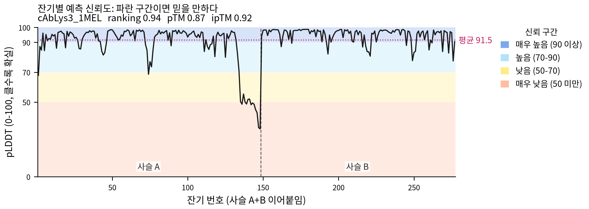

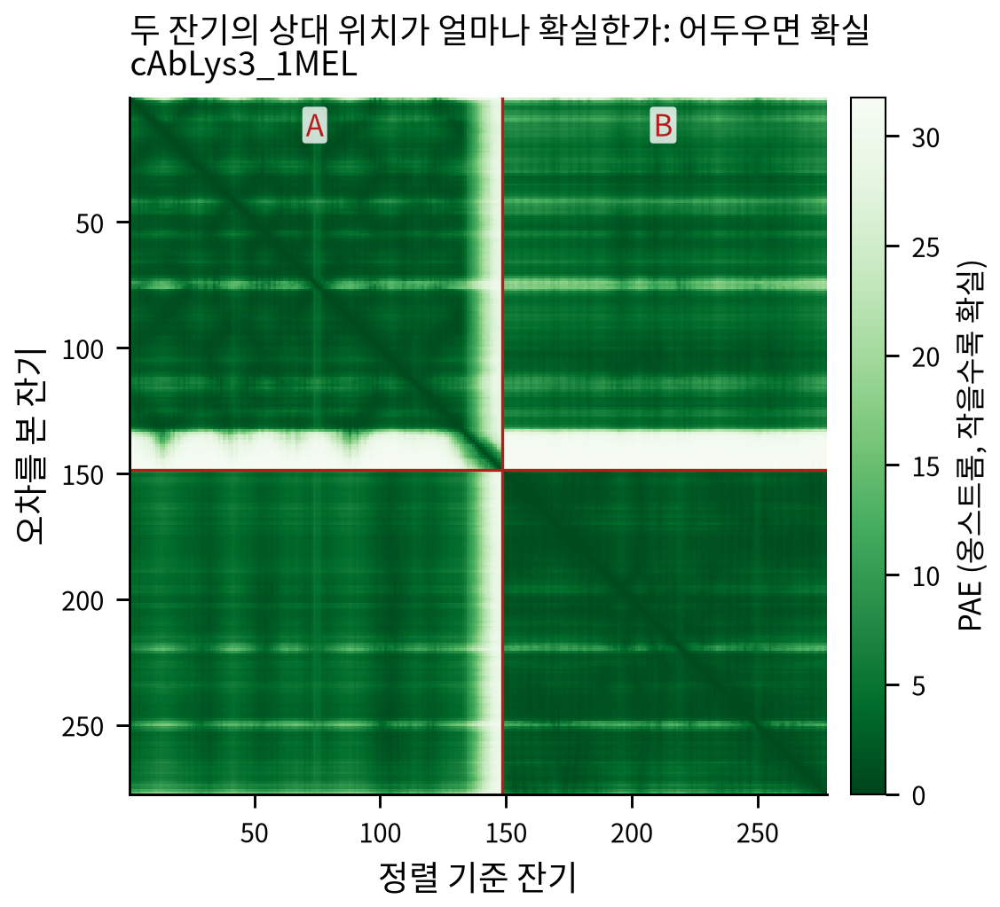

pLDDT 그림에서 파란 구간은 믿을 만하고, 주황으로 떨어지는 끝부분은 위치가 정해지지 않은
꼬리다. PAE 그림에서 사슬 경계는 빨간 선으로 나뉜다. 대각선 밖 블록이 어두우면 두 사슬의
상대 위치가 확실하다는 뜻이고, 옅으면 계면이 불확실하다.

여러 건을 한 번에 돌렸으면 요약 그림 한 장이 더 생긴다.

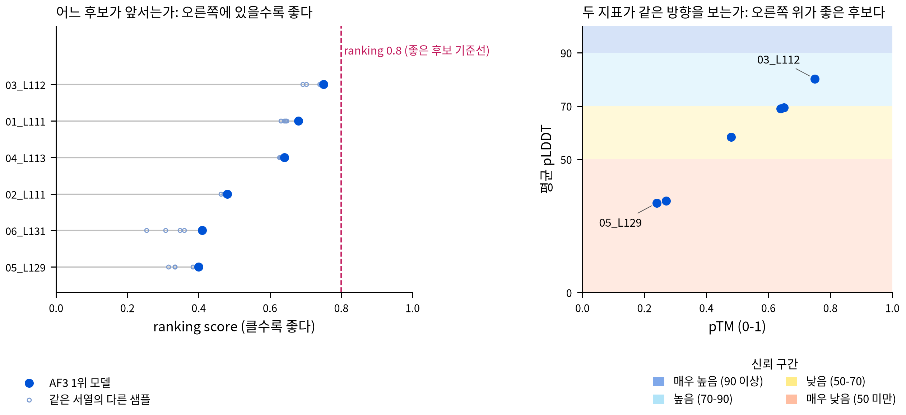

`af3_view3d.py` 로 만든 HTML 은 브라우저에서 바로 열린다. 왼쪽에 지표, 오른쪽에 3D 구조가
있고, pLDDT 색과 사슬 색을 버튼으로 바꾼다. `index.html` 은 ranking score 내림차순 목록이다.

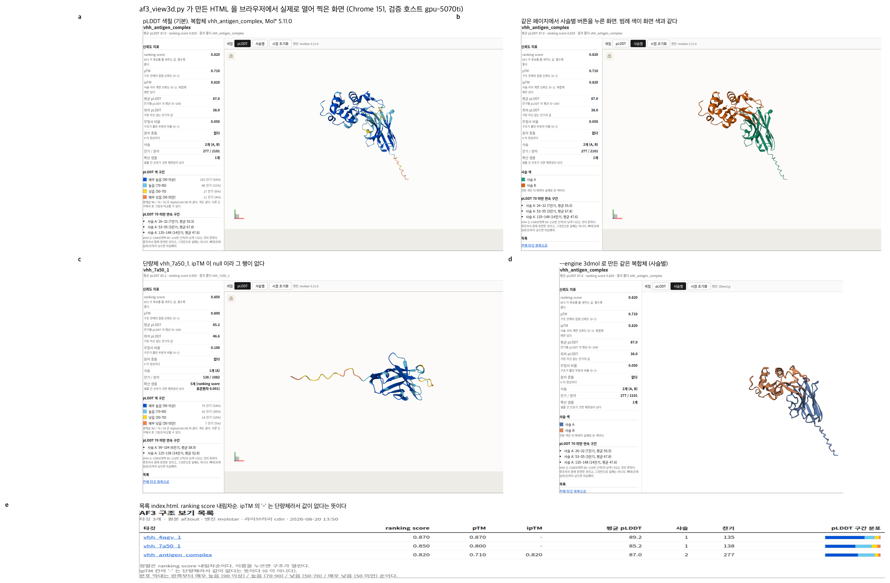

검토는 이 순서로 한다.

1. `D_낮음` 과 `C_계면실패` 를 뺀다.
2. `경고` 에 `충돌` 이 있는 건은 구조를 직접 열어 본다.
3. `샘플불안` 이 있는 건은 시드를 늘려 다시 돌린다.
4. 남은 것을 ipTM(복합체) 또는 pTM(단량체) 내림차순으로 정렬한다.
5. 상위 수십 건만 3D 뷰어로 눈으로 본다.

지표의 정의와 판정 근거는 [8절](#8-결과-해석)에 있다.

### 4. 본인 입력 준비

AlphaFold 3는 JSON을 입력으로 받는다. `af3_prepare.py`는 FASTA 또는 CSV/TSV 서열표를
읽어 레코드마다 AF3 JSON 하나를 만든다. 이미 AF3 형식의 JSON이 있다면 변환하지 않고
입력 폴더에 바로 둔다.

FASTA는 `>` 뒤에 타깃 이름을 쓰고 다음 줄에 아미노산 서열을 적는다.

```text
>sample_01
QVQLVESGGGLVQAGGSLRLSCAASGFPVAYKTMWWYRQAPGKEREWVAAIESYGIKWTRYADSVKGRFTISRDNAKNTVYLQMNSLKPEDTAVYYCIVWVGAQYHGQGTQVTVSA
```

파일 생성 전 `--dry-run`으로 이름, 서열, 토큰 수와 버킷을 확인한다.

```bash
python3 scripts/af3_prepare.py --fasta my_sequences.fasta -o my_project_in --dry-run
python3 scripts/af3_prepare.py --fasta my_sequences.fasta -o my_project_in

# 본인 입력 폴더로 배치 실행
python3 scripts/run_af3_batch_improved.py \
    --input-dir my_project_in --output-dir my_project_out \
    --db-dir ~/public_databases_full --yes
```

CSV/TSV도 사용할 수 있다. 첫 줄에는 열 이름이 있어야 하며 이름·서열 열은 자동 인식한다.
열 이름이 특수한 경우 `--name-col`과 `--seq-col`로 지정한다. 공통 항원, 리간드, homomer,
여러 seed 입력은 [5-3절](#5-3-af3_preparepy-fastacsv-에서-json-만들기)에 정리했다.

입력 파일과 복합체 구성의 관계는 다음과 같다.

| 준비하려는 작업 | 입력 방법 | 생성 결과 |
|---|---|---|
| 여러 단백질을 각각 예측 | multi-FASTA 또는 CSV/TSV | 레코드마다 독립 JSON 1개 |
| 같은 단백질 N부로 homomer 예측 | `--copies N` | 한 JSON 안에 동일 서열 사슬 N개 |
| 모든 대상에 같은 항원 추가 | `--partner-fasta antigen.fasta` | 대상마다 대상+공통 파트너 JSON 1개 |
| 공통 파트너 N부 추가 | `--partner-copies N` | 한 JSON 안에 공통 파트너 사슬 N개 |
| 서로 다른 단백질 사슬이 3종 이상 | AF3 JSON을 직접 작성 | `sequences` 배열에 A, B, C 사슬을 각각 추가 |

multi-FASTA의 각 레코드는 서로 독립된 예측 작업이며, 여러 레코드를 한 복합체로 합치지
않는다.

### 5. 입력 유형별 실행 예제

A~D는 `--dry-run` 확인 후 JSON을 만들고, E는 제공 JSON의 문법을 확인한 뒤 같은 배치
러너로 실행한다. 필요한 입력 유형만 선택해서 실행하면 된다.

실제 입력 데이터는 다음 파일에서 확인할 수 있다. 파일 이름을 누르면 GitHub에서 전체
내용을 볼 수 있으며 그대로 내려받아 실행할 수 있다.

| 작업 | 입력 데이터 예제 | 파일 안의 구성 |
|---|---|---|
| 여러 단백질을 각각 예측 | [multi-FASTA 6종](examples/vhh_panel.fasta) | `>이름`과 VHH 서열 6개 |
| homomer | [단일 VHH FASTA](examples/vhh_single.fasta) | VHH 서열 1개 |
| 모든 대상에 같은 항원 추가 | [multi-FASTA 6종](examples/vhh_panel.fasta) + [공통 항원 FASTA](examples/antigen.fasta) | 대상 6개 + lysozyme 1개 |
| 공통 파트너 N부 추가 | [단일 VHH FASTA](examples/vhh_single.fasta) + [공통 항원 FASTA](examples/antigen.fasta) | 대상 1개 + 반복할 파트너 1개 |
| 서로 다른 단백질 3종 | [서로 다른 단백질 3사슬 JSON](examples/three_protein_complex.json) | `sequences` 배열의 A, B, C protein |
| 실제로 결합하는 3사슬 복합체 | [트랜스듀신 헤테로3량체 JSON](examples/gprotein_heterotrimer_1got.json) | PDB 1GOT 의 Gα 350 + Gβ1 340 + Gγ1 73 잔기. 계면이 실제로 잡히는 대조군이다 |

FASTA 예제는 공개 PDB 유래 서열이고, 3사슬 JSON은 입력 형식 확인용 조합이다. 실제 연구
서열은 같은 형식으로 별도 파일에 준비하며 Git에는 추가하지 않는다.

#### A. multi-FASTA의 단백질을 각각 예측

한 FASTA에 여러 서열을 넣되, 서로 합치지 않고 단백질별로 하나씩 예측할 때 사용한다.

```bash
python3 scripts/af3_prepare.py --fasta examples/vhh_panel.fasta -o panel_in --dry-run
python3 scripts/af3_prepare.py --fasta examples/vhh_panel.fasta -o panel_in
python3 scripts/run_af3_batch_improved.py \
    --input-dir panel_in --output-dir panel_out \
    --db-dir ~/public_databases_full --yes
python3 scripts/af3_collect.py panel_out -o panel_summary.csv
~/af3_plot_env/bin/python scripts/af3_visualize.py panel_out -o panel_figures
python3 scripts/af3_view3d.py panel_out --out-dir panel_viewer
```

아래 그림은 위 명령을 이 컴퓨터에서 full DB로 실행해 만든 결과다. 6건 모두 완료됐고
pTM은 0.82~0.90, 원자 평균 pLDDT는 82.9~92.7이었다. 다른 입력에서도 같은 점수가
나온다는 뜻은 아니다.

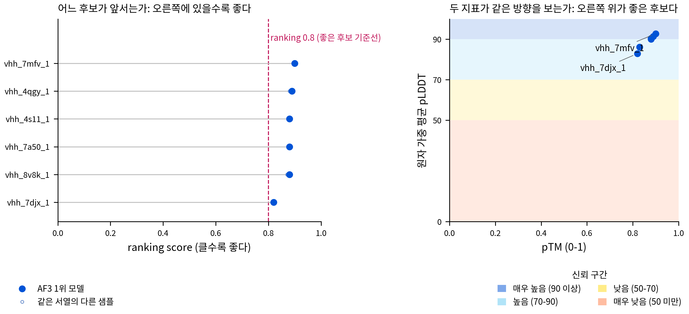

#### B. 같은 단백질 2부로 homodimer 예측

동일한 단백질 두 부가 함께 있는 구조를 예측할 때 `--copies 2`를 사용한다. 만들어지는
JSON에는 같은 서열의 A, B 사슬이 들어간다.

```bash
python3 scripts/af3_prepare.py --fasta examples/vhh_single.fasta \
    --copies 2 -o homodimer_in --dry-run
python3 scripts/af3_prepare.py --fasta examples/vhh_single.fasta \
    --copies 2 -o homodimer_in
python3 scripts/run_af3_batch_improved.py \
    --input-dir homodimer_in --output-dir homodimer_out \
    --db-dir ~/public_databases_full --yes
python3 scripts/af3_collect.py homodimer_out -o homodimer_summary.csv
~/af3_plot_env/bin/python scripts/af3_visualize.py homodimer_out -o homodimer_figures
python3 scripts/af3_view3d.py homodimer_out --out-dir homodimer_viewer
```

이 컴퓨터의 full DB 실행에서는 1건이 완료됐고 pTM 0.60, ipTM 0.30, 원자 평균 pLDDT
86.8이었다. 아래 PAE에서 A와 B 내부 블록은 어둡지만 사슬 사이 블록은 밝다. 각 사슬의
접힘보다 두 사슬의 상대 배치가 불확실하다는 뜻이며, homodimer 형성의 근거로 쓰지 않는다.

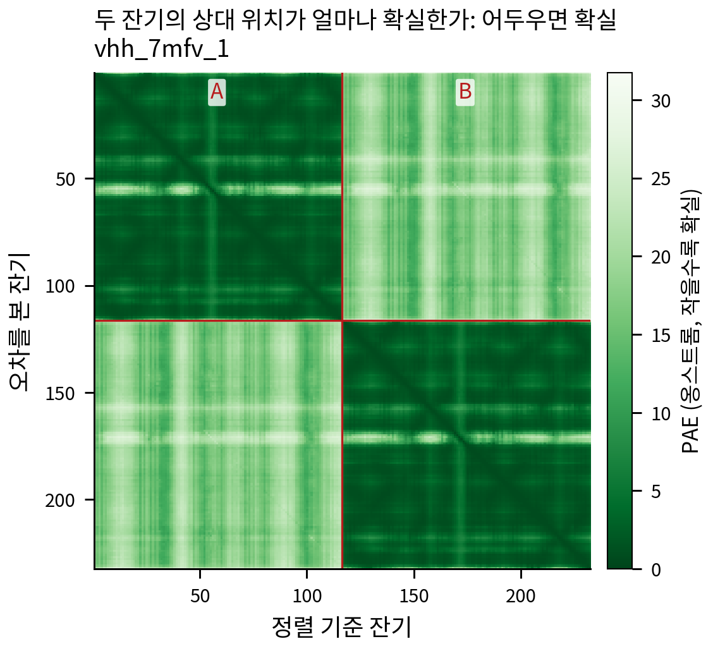

#### C. 여러 대상에 같은 항원 추가

VHH 6개에 같은 lysozyme을 하나씩 붙여 복합체 후보 6개를 계산한다. 파트너 FASTA에
레코드가 여러 개 있으면 첫 번째 레코드만 사용하고 경고를 출력한다.

```bash
python3 scripts/af3_prepare.py --fasta examples/vhh_panel.fasta \
    --partner-fasta examples/antigen.fasta -o antigen_panel_in --dry-run
python3 scripts/af3_prepare.py --fasta examples/vhh_panel.fasta \
    --partner-fasta examples/antigen.fasta -o antigen_panel_in
python3 scripts/run_af3_batch_improved.py \
    --input-dir antigen_panel_in --output-dir antigen_panel_out \
    --db-dir ~/public_databases_full --yes
python3 scripts/af3_collect.py antigen_panel_out -o antigen_panel_summary.csv
~/af3_plot_env/bin/python scripts/af3_visualize.py antigen_panel_out -o antigen_panel_figures
python3 scripts/af3_view3d.py antigen_panel_out --out-dir antigen_panel_viewer
```

#### D. 공통 파트너를 2부 추가

대상 한 부와 동일한 파트너 두 부를 한 복합체로 계산한다. `--partner-copies 2`를 주면
대상 A와 같은 파트너 B, C 사슬이 만들어진다.

```bash
python3 scripts/af3_prepare.py --fasta examples/vhh_single.fasta \
    --partner-fasta examples/antigen.fasta --partner-copies 2 \
    -o partner_dimer_in --dry-run
python3 scripts/af3_prepare.py --fasta examples/vhh_single.fasta \
    --partner-fasta examples/antigen.fasta --partner-copies 2 \
    -o partner_dimer_in
python3 scripts/run_af3_batch_improved.py \
    --input-dir partner_dimer_in --output-dir partner_dimer_out \
    --db-dir ~/public_databases_full --yes
python3 scripts/af3_collect.py partner_dimer_out -o partner_dimer_summary.csv
~/af3_plot_env/bin/python scripts/af3_visualize.py partner_dimer_out -o partner_dimer_figures
python3 scripts/af3_view3d.py partner_dimer_out --out-dir partner_dimer_viewer
```

#### E. 서로 다른 단백질 사슬 3종 예측

현재 `af3_prepare.py`는 서로 다른 protein 3종을 자동 조합하지 않는다. 이 경우 A, B, C
사슬이 들어 있는 AF3 JSON을 입력 폴더에 직접 둔다. 제공 파일은 JSON 문법과 3사슬 실행을
확인하기 위한 예제이며, 실제 생물학적 복합체를 뜻하지 않는다.

```bash
python3 -m json.tool examples/three_protein_complex.json >/dev/null
mkdir -p three_chain_in
cp examples/three_protein_complex.json three_chain_in/
python3 scripts/run_af3_batch_improved.py \
    --input-dir three_chain_in --output-dir three_chain_out \
    --db-dir ~/public_databases_full --yes
python3 scripts/af3_collect.py three_chain_out -o three_chain_summary.csv
~/af3_plot_env/bin/python scripts/af3_visualize.py three_chain_out -o three_chain_figures
python3 scripts/af3_view3d.py three_chain_out --out-dir three_chain_viewer
```

CSV의 `등급` 열로 1차 선별하고, 단량체는 pTM과 pLDDT평균, 복합체는 ipTM을 본다.
신뢰도는 정답 일치도가 아니라 후보를 줄이기 위한 순위 지표로 사용한다
(판정 기준은 [8절](#8-결과-해석)). 처음 사용하는 경우에는 2절 요구 사양부터
8절 결과 해석까지 순서대로 확인한다.

---

## 목차

[1. 저장소 범위](#1-이-저장소의-범위) ·
[2. 요구 사양](#2-요구-사양) · [3. 설치](#3-설치) · [4. 동작 확인](#4-동작-확인) ·
[5. 입력 파일 준비](#5-입력-파일-준비) · [6. 배치 실행](#6-배치-실행) ·
[7. 속도 개선 근거](#7-속도-개선의-근거) · [8. 결과 해석](#8-결과-해석) ·
[9. 결과 보기](#9-결과-보기) · [10. 자주 만나는 문제](#10-자주-만나는-문제) ·
[11. 라이선스와 인용](#11-라이선스와-인용) · [12. 측정 조건과 한계](#12-측정-조건과-한계)

---

## 1. 이 저장소의 범위

AlphaFold 3 대량 실행을 위한 설치·입력·DB·후처리 스크립트 12개를 제공한다.

| 스크립트 | 하는 일 |
|----------|---------|
| `scripts/install_af3_ubuntu.sh` | Ubuntu 단일 설치기. core 설치와 명시적 full 설치 |
| `scripts/af3_check.sh` | 환경 진단. GPU, 드라이버, 가중치, DB, 도커, HMMER |
| `scripts/af3_prepare.py` | FASTA/CSV 에서 AF3 입력 JSON 생성 |
| `scripts/af3_db.py` | full DB 검증과 원자적 reduced-MSA overlay 생성 |
| `scripts/run_af3_batch_improved.py` | 권장 배치 러너. 완료 판정을 최종 산출물로 하고 미완료 결과를 격리 보존하며 중복 실행을 차단한다 |
| `scripts/af3_batch.py` | 배치 러너. 컨테이너 1회 기동, MSA/추론 2단계 분리, 재시작, 재시도 |
| `scripts/af3run.sh` | legacy `af3_batch.py` 래퍼. 작업 이름 하나로 실행 |
| `scripts/af3_collect.py` | 출력 폴더의 신뢰도 지표를 CSV로 집계 |
| `scripts/af3_visualize.py` | pLDDT 플롯, PAE 히트맵, PyMOL/ChimeraX 색칠 명령 생성 |
| `scripts/af3_stage2.py` | `_data.json` 재사용으로 MSA 를 건너뛰는 2단계 입력 생성 |
| `scripts/af3_rankcorr.py` | 두 설정의 순위 상관·top-N 보존 비교 |
| `scripts/af3_view3d.py` | 무결성 검증된 Mol*/3Dmol 기반 로컬 HTML 뷰어 생성 |

이 저장소는 AlphaFold 3 자체를 배포하지 않는다. AF3 코드, 가중치, 데이터베이스는 포함하지 않는다
([3-1](#3-1-다운로드-목록)). 현재 저장소는 초대된 연구자만 접근하는 비공개 연구 협업 저장소다.
비공개 여부와 관계없이 가중치, `ccd.pickle`, DB, 실제 연구 서열은 Git에 추가하지 않는다.
`.gitignore`는 실수 방지용이며 최종 확인은 커밋하는 사람이 담당한다
([11절](#11-라이선스와-인용)).

타깃이 10건 이하면 AF3 공식 명령이 더 간단하다. 이 저장소는 짧고 유사한 서열을
수백 건 이상 처리하는 항체 라이브러리, 나노바디 패널, 점돌연변이 시리즈에 맞춰져 있다.

---

## 2. 요구 사양

| 항목 | 요구 | 근거 |
|------|------|------|
| GPU | **짧은 VHH는 RTX 3080 Ti 12GB에서도 실제 추론됐다.** 1024-token 공식 stress는 기본 메모리 설정에서 OOM, unified memory에서 통과했다. 일반 입력의 보장은 아니다 | 2026-08-20 실측 |
| 실제 VRAM 피크 (VHH 116~144 aa, sample 5 곱하기 recycle 10) | **2,942~2,963 MiB** | gpu-5070ti 23런 |
| CPU | 8코어 이상 권장. MSA 단계 속도를 직접 결정한다 | 실측 |
| RAM | 검증 호스트는 126GB. 축소 DB 만 쓰면 훨씬 적어도 된다 (하한 미측정) | |
| 디스크 | full DB 해제본 약 627GiB. 압축본 223GiB를 함께 보존하면 peak 약 850GiB. reduced-MSA overlay는 약 2GB지만 템플릿 fallback용 full DB를 유지해야 한다 | 2026-08-21 실측 |

이전 RTX 5070 Ti 측정에서 `nvidia-smi`는 15,157 MiB를 사용 중이라고 표시했다. 이는
실사용량이 아니라 XLA 선점량이었다. 현재 Docker full 실행에서도 MSA 단계에 약 11.7GB를
미리 잡았지만 GPU 연산은 아직 시작하지 않은 상태였다.

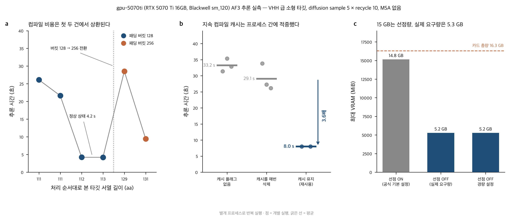

원 측정값 (카드 총량 16,303 MiB): 선점 ON 15,157 MiB(**예약량이다. 수요가 아니다**),
선점 OFF 스모크 1건 5,291 MiB, 선점 OFF 배치 23런 2,942~2,963 MiB. 뒤 두 값의 차이는
계측 조건 차이(단발 실행 대 순회 정상상태)이고 어느 값이든 16GB 카드에 여유롭게 들어간다
([docs/benchmark_report.md](docs/benchmark_report.md)). 위 그림 (c) 의 GB 표기는 환산
기준(1024 대 1000)이 섞여 있으므로 **정확한 값이 필요하면 이 문단의 MiB 를 쓴다.**

### 동작이 확인된 버전 조합

공통 기준은 AF3 commit `97d20234c6eb89e8d05376e9eecc9321e60a559b`
(tag `v3.0.4-15-g97d2023`), JAX/jaxlib 0.10.2, HMMER 3.4와 AF3의
`--seq_limit` 패치다.

현재 Docker 경로는 Ubuntu 26.04, kernel 7.0.0, Docker Engine 29.7.2,
NVIDIA Container Toolkit 1.20.0, RTX 3080 Ti 12GB, driver 595.84에서 검증했다.
이미지는 CUDA 12.6.3 기반, Python 3.12.3, AF3 3.0.4이며 컨테이너 안의 JAX가
`CudaDevice(id=0)`을 확인했다.

이전 native 측정은 RTX 5070 Ti에서 Python 3.12.13, CUDA 12.9 JAX 번들,
jax-cuda12-plugin/pjrt 0.10.2, numpy 2.5.2, rdkit 2025.9.4, dm-haiku 0.0.17,
tokamax 0.0.12 조합이었다. 두 경로 모두 시스템 `nvcc`를 따로 설치하지 않았다.
세부 설치 기록은 [docs/install_log.md](docs/install_log.md)에 있다.

---

## 3. 설치

설치 경로는 두 갈래이고 갈리는 지점은 데이터베이스다.

| 경로 | 실작업 시간 | 디스크 | 어떤 경우에 |
|------|-------------|--------|-------------|
| **A. reduced-MSA overlay + full fallback** | full 다운로드 후 1분 안팎 추가 (실측 16.7초) | full 해제본 627GiB + overlay 약 2GB | MSA 속도 실험·단량체 스크리닝 |
| **B. full DB** | 회선에 따라 수 시간 | 해제본 약 **627GiB**; 압축본 보존 시 peak 약 850GiB | 공식에 가장 가까운 기본 경로·복합체 예측 |

모델 가중치는 Google이 제공하는 URL에서 직접 받아야 하며 현재 약관을 먼저 확인한다.
배치 러너는 Docker 전용이다. Ubuntu 설치 명령은 아래에 있고, 다른 배포판은
[Docker Engine 설치 문서](https://docs.docker.com/engine/install/)와
[NVIDIA Container Toolkit 설치 문서](https://docs.nvidia.com/datacenter/cloud-native/container-toolkit/latest/install-guide.html)를
따른다. native 설치는 [3-7](#3-7-native-설치-러너와-별도)의 별도 경로다.

### 3-1. 다운로드 목록

| 단계 | 받을 것 | 용량 | 어디서 | 시간 |
|------|---------|------|--------|------|
| ① | **AF3 소스 코드** | 수십 MB | https://github.com/google-deepmind/alphafold3 (Apache 2.0) | 1~2분 (추정) |
| ② | **도커 이미지** | 로컬 unpacked 15.5GB + 빌드 캐시 24.0GB. `image inspect` 크기 4,699,381,677 B | 위 소스의 `docker/Dockerfile` 로 빌드 | 첫 빌드 34분 (2026-08-21 실측) |
| ③ | **가중치 약관 확인** | | Google에서 직접 받은 파일만 사용 | 사용자 확인 |
| ④ | **모델 가중치 `af3.bin.zst`** | 1,020,545,840 B | 공식 Google Storage URL | 회선에 따라 |
| ⑤ | **`ccd.pickle`** | 수백 MB. 2026-08-20 native 재검증에서는 568,392,544 B | 받는 것이 아니라 현재 환경의 `build_data` 로 굽는다 | 23.5초 (이번 native 실측). 설치 시 1회 |
| ⑥-A | **reduced-MSA overlay** | 약 2GB 추가 | full DB의 7개 MSA FASTA를 완전 레코드 경계에서 자른다 | 1분 안팎 (실측 16.7초) |
| ⑥-B | **전체 DB** | 압축 238.8GB(223GiB), 해제본 약 **627GiB** | `fetch_databases.sh` (승인 불필요) | 회선 의존. 과거 빠른 회선 3시간 13분 |
| ⑦ | 첫 실행 컴파일 | | | **최대 406~497초 (실측)**, 이후 웜 6.55~8.5초 |
| | **이 저장소** | 수 MB | https://github.com/kangk1204/Kang_AF3 | 스크립트와 문서만 |

가중치는 **비영리 목적으로만 쓸 수 있고 재배포가 금지**돼 있다. 약관은 구글로부터 직접
받은 경우만 사용을 허용하므로 동료에게 복사해 받으면 위반이다. `ccd.pickle` 과 DB 파일도
저장소에 커밋하면 안 된다 ([11절](#11-라이선스와-인용),
[docs/license_notes.md](docs/license_notes.md)).

### 3-2. Ubuntu 단일 설치기

지원 범위는 Ubuntu 22.04/24.04/26.04 amd64와 이미 동작하는 NVIDIA 드라이버다.
드라이버 설치·업그레이드는 재부팅과 장비별 판단이 필요하므로 이 스크립트가 건드리지
않는다. 먼저 `nvidia-smi`가 성공하는지 확인한다. 설치기는 이 저장소 안의 진단·DB 검증
도구를 함께 쓰므로 스크립트 파일 하나만 따로 받지 말고 저장소 전체를 clone한다.

full 설치는 약 1TB의 빈 공간과 수 시간의 다운로드가 필요하다. Google의
[현재 가중치 약관](https://github.com/google-deepmind/alphafold3/blob/main/WEIGHTS_TERMS_OF_USE.md)을
직접 읽고 수락한 경우에만 다음 명령을 실행한다.

```bash
cd ~/af3_work/Kang_AF3
bash scripts/install_af3_ubuntu.sh --full --accept-weights-terms
```

`--accept-weights-terms`는 사용자가 원문을 직접 확인했다는 명시적 표시일 뿐, 스크립트가
법적 판단을 대신한다는 뜻이 아니다. 이 플래그가 없으면 full 설치는 `sudo`, 네트워크,
파일 쓰기 전에 중단한다.

가중치와 DB를 나중에 받을 경우 core 설치만 한다.

```bash
bash scripts/install_af3_ubuntu.sh
```

core는 Docker CE, NVIDIA Container Toolkit, 고정 AF3 이미지와 `~/af3_plot_env`를
설치한다. full은 여기에 검증된 가중치와 full DB를 추가한다. 기존 항목이 정확하면
재사용하고, 잘못된 가중치·불완전한 최종 DB·출처 label 없는 이미지·설치기가 만들지 않은
plot venv·충돌하는 소스는 덮어쓰거나 지우지 않고 이유를 표시한 뒤 멈춘다. DB는
`<DB경로>.partial`에서 받은 뒤 검증을 통과해야 최종 경로로 옮긴다. 검증은 파일 존재뿐
아니라 고정 v3.0 FASTA 8개의 정확한 byte 크기와 SHA-256을 확인한다. mmCIF는 보존된 공식
압축본의 SHA-256을 우선 확인하고, 압축본이 없으면 195,858개 파일의 정렬된 content-tree
SHA-256을 계산한다. 이 deep 검증은 약 480~650GB를 읽으므로 저장장치에 따라 수십 분에서
수 시간이 걸릴 수 있다.

실행 전에 계획과 경로만 보려면 다음처럼 한다. `--dry-run`은 `sudo`, 네트워크, 파일 쓰기를
하지 않는다.

```bash
bash scripts/install_af3_ubuntu.sh --dry-run --full --accept-weights-terms
```

기본 경로는 `~/af3_work`, `~/af3_models`, `~/public_databases_full`,
`~/af3_plot_env`다. 다른 디스크를 쓸 때는 절대경로 환경변수로 바꾼다.

```bash
AF3_DB_DIR=/data/af3/public_databases_full \
  bash scripts/install_af3_ubuntu.sh --full --accept-weights-terms
```

설치 중에는 현재 로그인 세션에 새 그룹이 아직 반영되지 않아도 임시 docker-group shell로
검증을 끝낸다. 설치가 끝난 뒤 로그아웃·로그인해야 일반 배치 명령이 `sudo` 없이 동작한다.
docker 그룹은 호스트 root 권한에 준하므로 신뢰하는 사용자만 넣는다.

#### 수동 설치 fallback

자동 설치기가 기존 APT 설정과 충돌해 멈췄다면 그 파일을 임의로 덮어쓰지 않는다. 배포판과
기존 설정에 맞춰 [Docker Engine 공식 Ubuntu 절차](https://docs.docker.com/engine/install/ubuntu/)와
[NVIDIA Container Toolkit 공식 절차](https://docs.nvidia.com/datacenter/cloud-native/container-toolkit/latest/install-guide.html)를
적용한 뒤 아래 두 명령으로 확인한다. 서명 키와 저장소 형식은 바뀔 수 있으므로 오래된
복사 명령을 README에 중복해 두지 않는다.

```bash
docker run --rm \
  hello-world@sha256:5dd0d3e6e255913fc30f90b9f2b1d359cc2cbdb48090cc4b65f1676e203243cc
docker run --rm --runtime=nvidia --gpus all \
  ubuntu@sha256:2260313b31c8c011cd2eebe728008efac1b3982be73eb71348ea2648d2c0e09b \
  nvidia-smi
```

두 번째 명령에 자신의 GPU 이름과 드라이버 버전이 나오면 Docker GPU 경로가 준비된 것이다.
2026-08-21 검증 호스트에서는 Docker Engine 29.7.2, NVIDIA Container Toolkit 1.20.0,
driver 595.84, RTX 3080 Ti가 확인됐다.

AF3 소스를 고정한 커밋으로 받은 뒤 공식 Dockerfile을 빌드한다.

```bash
mkdir -p ~/af3_work && cd ~/af3_work
git clone https://github.com/kangk1204/Kang_AF3.git
git clone https://github.com/google-deepmind/alphafold3.git
cd ~/af3_work/alphafold3
git checkout 97d20234c6eb89e8d05376e9eecc9321e60a559b   # 확인된 커밋 (권장)
docker build -t alphafold3 -f docker/Dockerfile .       # 첫 빌드 실측 34분
docker image ls | grep alphafold3                       # 빌드 확인
cd ~/af3_work/Kang_AF3                                  # 이후 명령은 항상 여기서
```

이미지 이름을 `alphafold3` 로 두면 이 저장소의 스크립트가 기본값으로 찾는다. 다른 이름은
`--image` 또는 환경변수 `AF3_IMAGE` 로 알려준다. 첫 빌드에서는 HMMER와 CUDA Python
패키지를 내려받고 컴파일하므로 로그가 한동안 뜸할 수 있다.

### 3-3. 모델 가중치 확보

가중치는 반드시 Google에서 직접 받고
[현재 이용약관](https://github.com/google-deepmind/alphafold3/blob/main/WEIGHTS_TERMS_OF_USE.md)을
준수한다. 동료에게 복사하거나 이 저장소에 커밋하지 않는다.

**신청서를 내거나 승인을 기다릴 필요는 없다.** 아래 URL 은 바로 받아진다. 대신 약관이
**받아서 쓰는 행위 자체를 동의로 본다.** 그래서 받기 전에 약관을 한 번 읽고, 아래 세
가지를 확인한다. ① 비영리 목적인가 ② 재배포하지 않을 것인가(사내 스토리지·공유 폴더·깃
저장소 모두 해당한다) ③ 출력물로 다른 구조예측 모델을 학습시키지 않을 것인가.
내려받은 날짜를 적어 두면 나중에 근거가 된다. 자세한 것은
[11절](#11-라이선스와-인용)과 [docs/license_notes.md](docs/license_notes.md) 에 있다.

설치기를 `--full` 로 돌리면 아래 과정이 자동으로 실행된다. `--accept-weights-terms` 를 붙이는
것이 약관을 확인했다는 표시다. 손으로 받으려면 이렇게 한다.

```bash
mkdir -p ~/af3_models
curl -L --fail --continue-at - \
  https://storage.googleapis.com/alphafold3/af3.bin.zst \
  -o ~/af3_models/af3.bin.zst
zstd -t ~/af3_models/af3.bin.zst
zstd -d -f ~/af3_models/af3.bin.zst -o ~/af3_models/af3.bin

ls -l ~/af3_models/af3.bin
sha256sum ~/af3_models/af3.bin
# 검증값
#   크기   : 1146811260  (약 1.15GB)
#   sha256 : df8bbf2621f17dd3ee21c2a921e84a50bc2b80cdc0c7971cb915c2826fee1f9b
```

`af3.bin.zst` 는 1,020,545,840 B 이고 가중치 안에는 파라미터가 368,384,602개 있다.
이 저장소는 pinned AF3 commit과 함께 위 크기를 엄격히 검사한다. 다른 모델 release를
의도했다면 코드·가중치·출력 계약을 함께 다시 검증해야 한다.

검증을 끝내고 다른 release 를 의도적으로 쓸 때만, 배치 러너의 크기 검사를
`AF3_MODEL_BYTES` 로 바꿀 수 있다. 조용히 넘어가지 않고 실행할 때마다 경고를 찍는다.
(`af3_check.sh` 의 `AF3_MODEL_SHA256` 과 같은 성격의 탈출구다.)

```bash
AF3_MODEL_BYTES=$(stat -c %s ~/af3_models/af3.bin) \
  python3 scripts/run_af3_batch_improved.py --input-dir vhh_001_in --output-dir vhh_001_out
```

### 3-4. build_data

공식 Dockerfile이 이미지 빌드 중 `uv run build_data`를 이미 실행한다. Docker 설치에서는
별도의 임시 `docker run ... build_data`가 필요 없다. native 설치에서만 직접 실행한다.

### 3-5. 데이터베이스 선택

**overlay로 무엇을 잃는가** (2026-08-25 같은 날 같은 기본 설정으로 나란히 실측.
확산 샘플 5, recycle 기본. 화살표는 `overlay → full DB`)

| 입력 | ranking | pTM | ipTM | pLDDT 평균 | 등급 | overlay MSA 깊이 (unpaired, 사슬 순) |
|---|---|---|---|---|---|---|
| 1사슬 `vhh_7mfv_1` (116) | 0.900 → 0.900 | 0.900 → 0.900 | - | 92.36 → 92.69 (-0.33) | A_높음 = A_높음 | 11 |
| 2사슬 `vhh_antigen_complex` (148+129) | 0.850 → 0.910 (**-0.06**) | 0.730 → 0.840 (**-0.11**) | 0.850 → 0.900 (**-0.05**) | 87.28 → 90.51 (**-3.24**) | A_계면신뢰 = A_계면신뢰 | 11 / 4 |
| 3사슬 형식 예시 `three_protein_complex` (116+129+138, **비복합체**) | 0.220 → 0.430 (**-0.21**) | 0.400 → 0.550 (**-0.15**) | 0.150 → 0.370 (**-0.22**) | 78.80 → 83.53 (**-4.73**) | C_계면실패 = C_계면실패 | 11 / 4 / 7 |
| 3사슬 진짜 복합체 `gprotein_heterotrimer_1got` (350+340+73) | 0.930 → 0.930 | 0.820 → 0.800 (+0.02) | 0.870 → 0.880 (-0.01) | 87.75 → 88.16 (-0.41) | A_계면신뢰 = A_계면신뢰 | **40 / 1135 / 10** |

| 입력 | overlay MSA | full DB MSA | overlay 전체 | full DB 전체 |
|---|---|---|---|---|
| 1사슬 | 4.4초 | 2055.0초 | 52.6초 | 34.8분 |
| 2사슬 | 23.6초 | 4115.3초 | - | 69.8분 |
| 3사슬 형식 예시 | 26.6초 | 6414.0초 | 80.0초 | 107.9분 |
| 3사슬 1GOT | 15.0초 | 6304.8초 | 138.9초 | 106.9분 |

**손실을 정하는 것은 사슬 수가 아니라 overlay 가 그 단백질에서 얻는 MSA 깊이다.**
진짜 3사슬 복합체인 트랜스듀신 헤테로3량체
(PDB 1GOT, Gα·Gβ1·Gγ1)는 overlay 에서도 Gβ1 에 1,135개, Gα 에 40개 서열이 잡혔고,
그 결과 ranking score 가 같고 ipTM 차이가 0.01 이다. 반면 VHH 계열은 overlay 에서
한 자리~열 자리 서열밖에 못 얻었고, 그 건들에서 계면 지표가 떨어졌다. Gβ1 은
WD40 반복 계열이라 데이터베이스를 잘라도 동족체가 많이 남는다. VHH 는 그렇지 않다.

**네 건 모두 집계기 등급은 같았다.** 지표는 움직여도 등급은 뒤집히지 않았다. 다만 형식 예시는 서로 무관한 단백질 3종이라 애초에 복합체가
아니고, 양쪽 다 `C_계면실패` 로 옳게 버린 것이다. 진짜 복합체에서 등급이 같았던
것은 1GOT 한 건이다. 네 건은 규칙을 세우기에 적은 수다.

**overlay 의 ipTM 은 낮게도, 높게도 나온다.** 나노바디 복합체 10건을 overlay 로 훑고
그중 경계 근처 3건을 full DB 로 다시 돌린 결과다.

| 타깃 | overlay ipTM | full DB ipTM | 등급 |
|---|---|---|---|
| `nb_1kxt` | 0.59 | **0.20** | C_계면실패 = C_계면실패 |
| `nb_1kxv` | 0.18 | 0.15 | C_계면실패 = C_계면실패 |
| `cplx_4krl` | 0.13 | 0.13 | C_계면실패 = C_계면실패 |

`nb_1kxt` 는 overlay 가 **0.39 높게** 나왔다. 얕은 MSA 가 계면을 과대평가한 것이다.
앞의 VHH-항원 복합체에서는 반대로 overlay 가 0.05 낮았다. 즉 방향이 일정하지 않으므로
**overlay 의 ipTM 은 크든 작든 그대로 믿을 수 없다.**

한편 지금까지 대조한 복합체 7건에서 **집계기 등급이 뒤집힌 적은 없다.** 거르는
용도로는 그래서 쓸 만하다.

정리하면 이렇다. **집계 CSV 의 `MSA_unpaired깊이` 열을 본다.** overlay 로 돌렸는데
수백 이상이면 full DB 와 거의 같은 답이 나왔고, 한 자리~열 자리면 계면 지표
(ipTM, pLDDT)가 눈에 띄게 낮게 나왔다. 후자는 거르는 데만 쓰고 최종값으로 읽지

두 선택지의 실측 차이:

| 항목 | 축소 DB (약 2GB) | 전체 DB | 배수 |
|------|------------------|-----------------|------|
| MSA unpaired / paired 깊이 | 9~13 / 158~225 | 10,640~10,745 / 24,250~27,353 | **818~1,186배 / 120~150배** |
| 건당 시간 (end-to-end) | 43.3초 | 1,830초 | **42.2배** |
| 2000건 환산 | 24시간 | **1,017시간 (42일)** | 해당 없음 |

MSA 깊이가 1000배 차이나는데 **VHH 단량체의 신뢰도는 거의 변하지 않았다.** 6종을 양쪽
조건으로 모두 돌린 결과 ranking score 는 무변화 3건, +0.03 2건, -0.01 1건이었다
(0.82~0.90 범위, pLDDT평균 차이 -0.99~+2.12). 그 -0.01 은 같은 조건에서 샘플 5개를
돌렸을 때의 산포(0.002~0.008)를 살짝 넘지만 판정을 바꿀 크기가 아니다
(타깃별 값은 [results_example/af3_summary.csv](results_example/af3_summary.csv)).
나노바디는 면역글로불린 폴드가 잘 보존돼 있고 PDB 에 템플릿이 아주 많은데
**템플릿 검색은 양쪽 조건 모두 전체 PDB 를 쓴다.** 축소 DB 로 잃는 것은 공진화 신호이고
VHH 프레임워크는 그 신호 없이도 템플릿만으로 잡힌다.

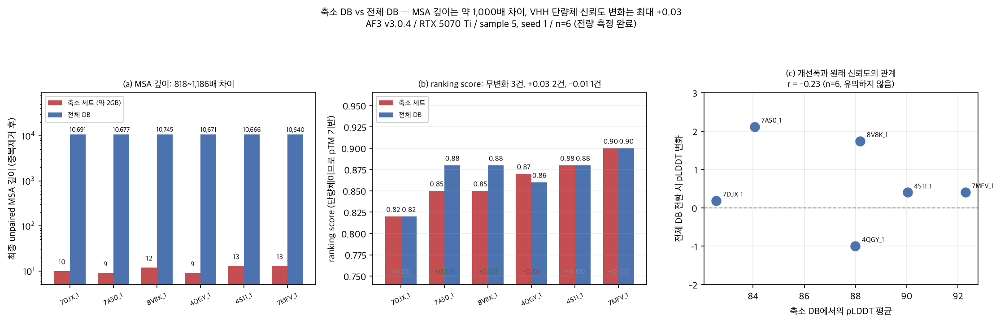

> 위 표의 818~1,186배는 AF3 가 DB 4종 결과를 합치고 중복을 제거한 뒤 최종 입력에 담은
> unpaired 깊이 기준이다. uniref90 하나만 검색해 나온 정렬 서열 수 기준으로는
> 31~34배(축소 705~811, 전체 23,693~25,503)이므로 **한 쪽 값을 다른 쪽과 섞어 인용하지
> 말 것.** 타깃별 짝은 [docs/db_notes.md](docs/db_notes.md) 에 있다.

어느 쪽을 골라야 하나:

- 단량체 VHH 를 수백에서 수천 건 전수 스크리닝한다: **축소 DB.** 전체 DB 로 2000건은
  약 42일이 걸려 전수 스크리닝에는 적합하지 않다.
- 항원-나노바디 복합체의 결합을 보고 싶다(ipTM 이 필요하다): **full DB를 기본으로 권한다.**
  paired MSA 차이가 계면에 영향을 줄 가능성은 있지만, 비교 6종이 모두 단량체여서
  이 저장소는 ipTM 개선을 직접 측정하지 않았다 ([12절](#12-측정-조건과-한계)).
- 실용적인 조합은 축소 DB 로 전수 스크리닝하고 상위 후보 수십 건만 전체 DB 로 재계산하는 것이다.

**이미 축소 DB로 돌린 결과는 6개 단량체 panel의 탐색 자료로는 남길 수 있다.** 다만
외부 정답 구조, CDR geometry, 복합체 계면, 대규모 순위 보존을 검증한 결과는 아니다.

#### ⑥-B full DB 다운로드와 검증

공식 스크립트는 `wget`, `tar`, `zstd`를 요구하며 9개 다운로드를 동시에 실행한다.
중간 파일·resume·checksum 기능은 없으므로 `tmux`에서 실행하고 완료 뒤 반드시 검증한다.

```bash
sudo apt install -y wget tar zstd
cd ~/af3_work/alphafold3
bash fetch_databases.sh ~/public_databases_full
cd ~/af3_work/Kang_AF3
python3 scripts/af3_db.py verify --db-dir ~/public_databases_full
```

`af3_db.py verify`는 8개 비어 있지 않은 FASTA와 실제 `.cif`가 든 `mmcif_files`를 확인하는
빠른 구조·경로 사전점검이다. 수백 GB의 byte 단위 checksum 검증은 단일 설치기를
`--full`로 실행할 때 수행한다.
2026-08-21 재검증에서 해제본은 약 627GiB였고, 압축본 223GiB를 함께 보존했을 때
디렉터리 peak가 약 850GiB였다. 회선과 파일시스템에 따라 시간은 크게 달라지므로 자신의
환경 기록을 우선한다. 다운로드가 끊겼다면 반쪽 파일을 정상으로
간주하지 말고 공식 스크립트를 다시 실행한 뒤 압축 해제 성공, 예상 규모, `verify`를 함께
확인한다.

#### ⑥-A reduced-MSA overlay 생성

공식 standalone 축소 DB는 없다. 이 저장소가 지원하는 경량 구성은 full DB 앞에 두는
7개 FASTA overlay다. 템플릿 `pdb_seqres`와 `mmcif_files`는 full fallback에서 읽는다.
따라서 full DB를 삭제할 수 없고 디스크 절약용 기능이 아니라 MSA 검색량 실험용이다.

```bash
cd ~/af3_work/Kang_AF3
python3 scripts/af3_db.py reduce \
  --source ~/public_databases_full \
  --output ~/public_databases_reduced
python3 scripts/af3_db.py verify \
  --db-dir ~/public_databases_reduced \
  --db-dir ~/public_databases_full

python3 scripts/run_af3_batch_improved.py \
  --db-dir ~/public_databases_reduced \
  --db-dir ~/public_databases_full \
  --yes
```

도구는 모든 source를 먼저 검사하고, 완전한 FASTA 레코드까지만 쓰며, output/prefix SHA-256·레코드수·
바이트수가 든 `af3_db_manifest.json`을 만든 뒤 디렉터리를 원자적으로 publish한다.
`verify`는 manifest schema와 파일 byte 수를 자동 대조한다. 매 실행 때 multi-GB 전체 hash를
다시 읽지는 않으므로 같은 크기 변조를 의심하면 manifest의 `output_sha256`과 직접 대조한다.
외부 `mmcif_files` symlink는 Docker 안에서 깨지므로 만들지도 허용하지도 않는다.

과거 벤치마크는 RCSB에서 선택한 1,239개 template와 대응하는 3,531개 chain의 `pdb_seqres`를
사용했다. 그 ID/query manifest가 이 저장소에 없어 **정확히 재현할 수 없는 역사적 측정**이다.
현재 overlay+full fallback 결과를 그 benchmark와 동일 조건이라고 부르지 않는다.

### 3-6. 폴더 관례

스크립트는 아래 배치를 기본으로 가정한다. 이대로 쓰면 옵션을 거의 안 줘도 된다.
`<이름>` 은 작업 하나를 가리키는 이름이다 (예: `vhh_001`).

```
~/public_databases_full/     공식 full DB
~/public_databases_reduced/  선택: reduced-MSA overlay (standalone 아님)
~/af3_models/                가중치 (af3.bin)
~/af3_work/                  작업 폴더. 여기서 명령을 실행한다
    alphafold3/              공식 AF3 source
    Kang_AF3/                이 저장소. 아래 작업 폴더도 여기 둔다
        <이름>_in/           입력 JSON
        <이름>_out/          결과
        <이름>_work/         로그, MSA 보관, 요약 CSV (스크립트가 만든다)
```

### 3-7. native 설치 (러너와 별도)

공식 AF3는 native 경로도 제공하지만 HMMER 3.4의 AF3 `--seq_limit` patch, Python 3.12,
JAX/CUDA 조합을 정확히 맞춰야 한다. 최신 명령은
[공식 설치 문서](https://github.com/google-deepmind/alphafold3/blob/main/docs/installation.md)를 따른다.
이 저장소의 두 batch runner는 Docker 명령을 조립하므로 native AF3를 대신 실행하지 않는다.
native에서는 공식 `uv run run_alphafold.py ...`를 직접 사용한다.

[docs/install_log.md](docs/install_log.md)는 2026-08-18 검증 호스트의 **역사적 설치 기록**이다.
현재 범용 설치 명령이나 Docker 대비 성능 보증으로 읽지 않는다.

### 3-8. 첫 실행 지연

처음 한 번은 XLA가 GPU 커널을 컴파일한다. 이전 native 측정에서는 콜드·고부하 상태의
고정 오버헤드가 406~497초, 웜 상태가 6.55~8.5초였다. 현재 Docker 검증에서는 준비된
116-token `_data.json`의 첫 실행이 전체 39.3초, 모델 추론 23.64초였다. GPU와 캐시,
입력 설정이 다르므로 어느 한 값을 다른 장비의 보장으로 쓰지 않는다.

raw JSON을 full DB로 실행하면 이 컴파일보다 MSA 검색이 훨씬 오래 걸린다. 그동안 GPU
사용률이 0%여도 정상이다. `_data.json`이 생성된 뒤 추론 단계에서 GPU가 동작한다.

컴파일 캐시 디렉터리를 지정하면 첫 컴파일을 재사용할 수 있다(스크립트가 기본으로 한다).
다만 캐시의 이득은 배치가 커지면 0으로 수렴한다. 첫 2건의 컴파일만 없애기 때문이고,
96건 순회에서 정상상태 4.20초는 캐시 유무와 무관했다 (실측).

### 3-9. 결과 그림용 Python 환경

단일 설치기를 사용했다면 이 환경은 이미 만들어져 있다. 수동 설치에서는 AF3 추론 환경과
분리해 matplotlib만 설치한다. 추론 환경에 설치하면 JAX가 요구하는 numpy 버전이 바뀔 수
있으므로 섞지 않는다.

```bash
sudo apt install -y python3-matplotlib python3-venv
cd ~/af3_work/Kang_AF3
python3 -m venv --without-pip --system-site-packages ~/af3_plot_env
~/af3_plot_env/bin/python -c 'import matplotlib; print(matplotlib.__version__)'
```

그림은 `~/af3_plot_env/bin/python`, 배치·집계·3D HTML은 시스템 `python3`로 실행한다.
matplotlib이 없어도 CSV와 뷰어 스크립트는 만들어지지만 PNG/PAE 그림은 생기지 않으므로,
정적 그림이 필요하면 위 마지막 명령이 성공하는지 먼저 확인한다.

---

## 4. 동작 확인

실행 전에 환경을 점검한다. 이 단계를 건너뛰면 장시간 실행 후에 DB 경로 오류를 발견할 수 있다.

```bash
cd ~/af3_work/Kang_AF3
AF3_DB_DIR=~/public_databases_full \
AF3_PYTHON=~/af3_plot_env/bin/python \
  bash scripts/af3_check.sh 2>&1 | tee af3_check.txt
```

환경 점검은 아래 6개 항목을 기준으로 판정한다.

| 확인 항목 | 통과 기준 |
|-----------|-----------|
| GPU 인식 | `nvidia-smi` 가 GPU 이름과 VRAM 을 출력한다 |
| 도커 이미지 | `alphafold3` 이미지가 목록에 있다 |
| 가중치 | `~/af3_models/af3.bin` 크기와 pinned SHA-256이 모두 일치한다 |
| DB 경로 | `af3_db.py verify`가 ordered root의 필수 9항목을 모두 찾는다 |
| HMMER | 선택한 Docker 이미지 안 `jackhmmer -h`에 `--seq_limit`가 보인다 |
| 디스크 | 작업 폴더에 여유가 있다 |

출력 형식은 스크립트 버전에 따라 다르다. 항목별 판정 표시(OK/실패)를 기준으로 읽는다.
`--seq_limit` 이 안 보이면 AF3 패치가 적용되지 않은 HMMER 다(도커 이미지를 쓰면 보통
문제되지 않는다). 실패 항목은 [10절](#10-자주-만나는-문제)에 정리해 두었다.

### 스모크 테스트: 1건 실제로 돌려 보기

```bash
cd ~/af3_work/Kang_AF3
mkdir -p smoke_in
cp examples/vhh_monomer.json smoke_in/
python3 scripts/run_af3_batch_improved.py \
  --input-dir smoke_in --output-dir smoke_out \
  --db-dir ~/public_databases_full --yes
ls smoke_out/*/
```

raw JSON과 full DB를 쓴 현재 Docker 실측은 35.5분이었다. 그중 MSA가 34.8분이고 GPU
추론은 15.23초였다. MSA 중에는 GPU 사용률이 0%여도 중단하지 않는다
([3-8](#3-8-첫-실행-지연)). 끝나면 `smoke_out/vhh_7mfv_1/` 안에
`*_ranking_scores.csv`, `*_summary_confidences.json`, `*_model.cif`가 생긴다. 세 파일이
모두 0바이트보다 크고 마지막에 `이번 대상 1/1건 완료`가 나오면 설치가 완료된 것으로 판정한다.

---

## 5. 입력 파일 준비

AF3 는 **타깃 하나당 JSON 파일 하나**를 입력으로 받는다. 2000건이면 JSON 2000개이므로
`af3_prepare.py` 로 만들고, 만들어진 JSON 은 `<이름>_in/` 에 둔다
([3-6](#3-6-폴더-관례)).

### 5-1. 입력 JSON 의 구조

가장 단순한 형태는 단백질 사슬 하나다 (`examples/vhh_monomer.json`). 아래 서열은
PDB 7MFV(합성 나노바디 Sb16, 116 aa)의 실제 서열이다.

```json
{
  "name": "vhh_7mfv_1",
  "modelSeeds": [1],
  "sequences": [
    {
      "protein": {
        "id": "A",
        "sequence": "QVQLVESGGGLVQAGGSLRLSCAASGFPVAYKTMWWYRQAPGKEREWVAAIESYGIKWTRYADSVKGRFTISRDNAKNTVYLQMNSLKPEDTAVYYCIVWVGAQYHGQGTQVTVSA"
      }
    }
  ],
  "dialect": "alphafold3",
  "version": 1
}
```

| 필드 | 뜻 |
|------|-----|
| `name` | 타깃 이름. **출력 폴더 이름이 이걸로 만들어진다.** 공백, 한글, 슬래시 피할 것 |
| `modelSeeds` | 난수 시드 배열. `[1]` 이면 시드 1개. 늘리면 시간도 비례해 늘어난다 |
| `sequences` | 이 구조에 들어가는 모든 실체의 배열. 여기 담긴 것 전부가 한 구조로 함께 예측된다 |
| `sequences[].protein.id` | 사슬 ID. `"A"`, `"B"` 등. 구조 파일에서 이 이름으로 보인다 |
| `sequences[].protein.sequence` | 아미노산 1문자 서열 |
| `dialect`, `version` | AF3 입력 형식 표시. 그대로 두면 된다 |

`protein` 자리에는 `dna`(`ACGT`), `rna`(`ACGU`), `ligand`(CCD 코드
`{"ligand": {"id": "L", "ccdCodes": ["ATP"]}}` 또는 SMILES) 도 올 수 있다.

### 5-2. 복합체: 항원 파트너 붙이기

`sequences` 배열에 항목을 추가하면 여러 사슬을 한 구조로 예측할 수 있다. 아래는 PDB
1MEL의 낙타 단일도메인 항체(148 aa)와 lysozyme 항원(129 aa) 예시다. JSON 구조를 보여주기
위해 서열을 줄여 표시했으며, 실행 가능한 전체 서열은 `examples/vhh_antigen_complex.json`에 있다.

```json
{
  "name": "vhh_antigen_complex",
  "modelSeeds": [1],
  "sequences": [
    { "protein": { "id": "A", "sequence": "DVQLQASGGG...WGQGTQVTVSSGRYPYDVPDYGSGRA" } },
    { "protein": { "id": "B", "sequence": "KVFGRCELAA...TDVQAWIRGCRL" } }
  ],
  "dialect": "alphafold3",
  "version": 1
}
```

서로 다른 단백질 사슬이 세 개라면 같은 `sequences` 배열에 `id`가 `"C"`인 protein 항목을
추가한다. AlphaFold 3 자체는 이와 같은 다중 사슬 JSON을 지원한다. 현재 `af3_prepare.py`는
대상 서열 1종과 공통 파트너 1종, 각 사슬의 복제 수, 선택적 리간드까지 자동 생성한다.
서로 다른 파트너가 두 종 이상인 임의 복합체는 JSON을 직접 작성한다.

복합체에서는 출력에 **ipTM(계면 신뢰도)** 이 함께 나온다. 단량체에서는 나오지 않는다.
복합체 예측에서는 두 가지를 고려한다. 첫째, **토큰 수가 늘어나 패딩 버킷이 커진다.**
버킷은 토큰 수 이상인 가장 작은 계단이 잡히므로 116 aa VHH 는 128 에 들어가지만 130 aa 는
이미 256 이고(실측 6종: 116/123 aa 는 128, 130/131/135/138 aa 는 256), 300 aa 항원을
붙이면 512 로 올라간다. 버킷 128 대 256 의 실측 차이가 2.25배(4.20초 대 9.44초)다.
둘째, **paired MSA 가 계면 예측에 중요하다.** 축소 DB 의 paired 깊이는 158~225, 전체
DB 는 24,250~27,353 이다. 복합체에는 전체 DB 를 써야 할 것으로 보이는데 이건 추론이고
직접 측정하지 못했다 ([12절](#12-측정-조건과-한계)).

### 5-3. `af3_prepare.py`: FASTA/CSV 에서 JSON 만들기

세부 옵션은 `python3 scripts/af3_prepare.py --help` 에 있다. 여기 적은 것보다
스크립트가 정확하다.

```bash
# multi-FASTA의 각 레코드를 독립된 JSON 1개로 변환
python3 scripts/af3_prepare.py --fasta examples/vhh_panel.fasta -o vhh_001_in

# 실행 전 --dry-run으로 생성 개수, 토큰 수, 패딩 버킷 분포를 확인한다
# 파일을 쓰지 않고 보여준다
python3 scripts/af3_prepare.py --fasta examples/vhh_panel.fasta -o vhh_001_in --dry-run

# 항원 파트너를 모든 타깃에 공통으로 붙이기 (복합체 스크리닝)
python3 scripts/af3_prepare.py --csv examples/vhh_panel.csv -o vhh_cplx_in \
    --partner-fasta examples/antigen.fasta --dry-run

# 시드 3개로 (시간이 3배 든다), 리간드 붙이기
python3 scripts/af3_prepare.py --fasta examples/vhh_panel.fasta -o vhh_in --seeds 1,2,3
python3 scripts/af3_prepare.py --fasta target.fasta -o with_atp_in --ligand-ccd ATP
```

대량 변환 전에는 `--dry-run`으로 이름 충돌과 입력 오류를 확인한다.
`--dry-run` 이 실제로 출력하는 버킷 분포는 이런 모양이다 (예제 6종).

```
토큰 수          : 최소 116, 중앙값 131, 최대 138
버킷 분포 (패딩 후 실제로 계산되는 크기)
  버킷 128   :     2 건 ( 33.3%)
  버킷 256   :     4 건 ( 66.7%)
```

길이 검증(`--min-len` 10, `--max-len` 3000), 비표준 알파벳(`--allow-ambiguous`),
동일 서열 복제(`--copies`)와 JSON version(`--json-version`) 등 세부 옵션은 `--help`에서 확인한다.

CSV 입력은 `name,sequence` 두 열을 갖는 형태다.

```csv
name,sequence
vhh_7djx_1,QVQLVESGGGLVQAGGSLRLSCAASGRTFSSYAMGWFRQAPGKERECVAAMDWSTSATYYADSVKGRFTISRDNAKNTVYLQMNSLKPEDTAVYYCAADLDYSDYGPFPGDMDYWGKGTQVTVSSHHHHHH
vhh_7a50_1,QVQLQESGGGLVQAGDSLRLSCAASGRTFSTYPMGWFRQAPGKEREFVAASSSRAYYADSVKGRFTISRNNAKNTVYLQMNSLKPEDTAVYYCVADSSPYYRRYDAAQDYDYWGQGTQVTVSSGRYPYDVPDYGSGRA
```

`examples/vhh_panel.csv` 와 `examples/vhh_panel.fasta` 가 같은 6종의 CSV 판과 FASTA
판이다(공개 PDB 유래). 이 6종이
[3-5절](#3-5-데이터베이스-선택) 의 DB 비교에 쓴 타깃과 같으므로
결과를 [results_example/af3_summary.csv](results_example/af3_summary.csv) 와 직접
비교할 수 있다. 리간드와 다량체 관련 옵션은 `--help`에서 확인한다.

### 5-4. 생성 결과 확인

```bash
ls vhh_001_in | head -3
ls vhh_001_in | wc -l
python3 -c "import json;print(json.load(open('vhh_001_in/vhh_A01.json'))['name'])"
find vhh_001_in -name '._*' -delete    # macOS 유래 사이드카를 지운다
```

`._`로 시작하는 파일은 입력 해석 오류를 일으킨다. 이 문제로 3시간 측정이 실패한 사례가
있다. 원인과 예방은 [10절](#10-자주-만나는-문제) 첫 항목에 있다.

---

## 6. 배치 실행

### 6-1. 권장 방법: `run_af3_batch_improved.py`

```bash
cd ~/af3_work/Kang_AF3
python3 scripts/run_af3_batch_improved.py --input-dir vhh_001_in --output-dir vhh_001_out --audit
python3 scripts/run_af3_batch_improved.py \
  --input-dir test_in --output-dir test_out --db-dir ~/public_databases_full
nohup python3 scripts/run_af3_batch_improved.py \
  --input-dir vhh_001_in --output-dir vhh_001_out \
  --db-dir ~/public_databases_full --yes > af3.log 2>&1 &
tail -f af3.log
```

입력 폴더의 JSON은 컨테이너 1회 기동으로 순회한다. 기본 폴더 이름은 파일 위쪽
`INPUT_DIR_NAME` / `OUTPUT_DIR_NAME` 에서 바꾸거나 `--input-dir` / `--output-dir` 로 준다.
`--yes`를 빼면 백그라운드에서 확인 질문을 받지 못해 멈춘다. 이는 대량 결과를 입력
폴더에 쓰는 실수를 막기 위한 장치다.

| 옵션 | 하는 일 |
|------|---------|
| `--guide` | 경로와 모드 설명만 보고 끝낸다. 아무것도 만들지 않는다 |
| `--audit` | 실행 없이 완료/미완료와 잔여 폴더만 점검. 미완료가 있으면 종료코드 1 |
| `--mode data` / `--mode inference` | MSA/템플릿만 (**GPU 를 할당하지 않아** 추론과 병행 가능) / 준비된 입력으로 추론만 |
| `--per-file` | 파일마다 컨테이너를 따로 띄운다 (느리다. 문제 격리용) |
| `--cleanup` | 격리 결과와 잔여 staging 을 미리 보여준 뒤 정리 |
| `--yes` | 확인 질문에 자동 응답. 백그라운드 실행에 필요 |
| `--docker COMMAND` | 자동 탐지 대신 Docker 명령을 명시. 자동 경로는 암호를 묻는 sudo를 선택하지 않는다 |
| `--db-dir PATH` | DB root. reduced overlay와 full fallback을 우선순서대로 반복 가능 |

이 러너는 완료 여부를 폴더가 아니라 최종 산출물로 판단한다. `_ranking_scores.csv`,
`_model.cif`, `_summary_confidences.json` 세 파일이 모두 있고 크기가 0보다 커야 완료다.
미완료 결과는 `.af3_incomplete/`로 옮겨 작업별 최신 한 건만 보존하며, 같은 출력 폴더의
중복 실행은 파일 잠금으로 막는다.

### 6-2. 보조 legacy 래퍼: `af3run.sh`

작업 이름 하나로 진단부터 집계까지 묶는다 (`af3_batch.py` 를 호출한다). 새 배포는 6-1의
권장 러너를 우선한다. 이 래퍼는 기존 2단계 작업과의 호환 경로다. 두 번째 인자가
모드다: `check`(환경 진단), `dry`(실행 없이 명령만 확인), `screen`(경량 스크리닝
sample 1 / recycle 3, 전수용), `full`(정밀 sample 5 / recycle 10, 상위 후보용),
`msa`, `infer`, `oneshot`(MSA + 추론을 한 프로세스에서), `retry`(실패한 것만),
`bench`(가장 짧은 20건의 경량 스모크), `collect`(CSV 집계).

2000건을 처음 돌릴 때의 권장 순서:

```bash
bash scripts/af3run.sh vhh_001 check      # 1. 환경
bash scripts/af3run.sh vhh_001 dry        # 2. 명령 확인
bash scripts/af3run.sh vhh_001 bench      # 3. 가장 짧은 20건으로 실행 경로 스모크
# 전체 시간은 버킷별 표본을 실제 운영 설정으로 별도 측정해 계산한다
bash scripts/af3run.sh vhh_001 screen     # 4. 전수
bash scripts/af3run.sh vhh_001 collect    # 5. 집계
```

### 6-3. `af3_batch.py` 직접 쓰기

전체 옵션은 `python3 scripts/af3_batch.py --help`에서 확인한다.

```bash
# 실행 계획 확인(계산하지 않음)
python3 scripts/af3_batch.py --name vhh_001 --db-dir ~/public_databases_full --dry-run

# 컨테이너 1회, MSA + 추론을 한 프로세스가 전수 순회
python3 scripts/af3_batch.py --name vhh_001 --db-dir ~/public_databases_full --stage oneshot

# 2단계 분리 (기본값이고 권장). MSA 먼저, 그 다음 추론
python3 scripts/af3_batch.py --name vhh_001 --db-dir ~/public_databases_full --stage both

# 경량 스크리닝 설정으로 전수
python3 scripts/af3_batch.py --name vhh_001 --stage both --diffusion-samples 1 --recycles 3

# 실패한 것만 재시도
python3 scripts/af3_batch.py --name vhh_001 --stage both --retry
```

`--stage` 는 `msa`(MSA 만, 산출물 `*_data.json` 을 `msa_store` 에 보관),
`infer`(보관된 MSA 로 추론만), `both`(기본값), `oneshot`(한 프로세스에서 둘 다) 네 가지다.

경로는 `--name` / `--input-dir` / `--output-dir` / `--db-dir` / `--model-dir` /
`--cache-dir` / `--image` / `--docker`, 계산량은 `--diffusion-samples`(스크리닝 1,
정밀 5) / `--recycles`(3, 10) / `--msa-n-cpu`(기본 `min(코어수/2, 8)`) /
`--msa-workers`(기본 1. **실측상 1이 최적이니 건드리지 말 것**) / `--limit N`,
재실행은 `--retry` / `--no-skip` 로 준다. 전체 목록은 `--help`, 명령 모음은
[docs/commands.md](docs/commands.md).

> ### 버킷 사다리에는 128을 포함한다
>
> AF3 의 기본 패딩 버킷 사다리는 128에서 시작한다 (`run_alphafold.py` 의 `_BUCKETS`
> 기본값, 소스 대조 및 실측 확인). 128을 빠뜨리면 토큰 128 이하인 짧은 VHH 가 갈 곳을
> 잃고 256 버킷으로 밀려 정상상태 추론이 **4.20초에서 9.44초, 2.25배**가 되고 2000건이면
> GPU 단계가 2.3시간에서 5.2시간이 된다.
>
> `af3_batch.py` 는 입력의 토큰 수를 세어 `[128, 256, 384, 512, ...]` 사다리에서 실제로
> 쓰이는 버킷만 골라 넘긴다. 기본값에서는 자동으로 선택된다. `af3_prepare.py --buckets`로
> 사다리를 직접 지정할 때는 128을 첫 항목으로 둔다. 결과 CSV의 `패딩버킷` 열이 256이면
> 이 경우에는 버킷 설정에서 128이 빠졌는지, 입력이 실제로 128 토큰을 넘는지 확인한다.

### 6-4. 2단계 전략: MSA 먼저, 추론 나중

MSA(CPU)와 추론(GPU)을 분리하면 MSA 산출물(`*_data.json`)이 `msa_store`에 보관된다.
추론 설정을 바꿔도 MSA를 다시 계산하지 않으므로 상위 후보의 정밀 재실행 시간을 줄일 수 있다.

```bash
# 1단계: MSA 만 전수 (CPU 바운드)
# 이 단계는 --norun_inference 라서 GPU 도 af3.bin 도 필요 없다.
# 가중치를 아직 내려받지 않은 core 설치에서도 여기까지는 돌릴 수 있다.
python3 scripts/af3_batch.py --name vhh_001 --stage msa

# 2단계: 추론만, 경량 설정으로 전수 (GPU) 후 집계해 상위 100건 목록을 만든다
python3 scripts/af3_batch.py --name vhh_001 --stage infer --diffusion-samples 1 --recycles 3
python3 scripts/af3_collect.py vhh_001_out --top 100 --top-list top100.txt

# 3단계: 상위 100건만 정밀 재실행. MSA 는 재사용되므로 빠르다
mkdir -p vhh_top_in
while read n; do cp "vhh_001_in/${n}.json" vhh_top_in/ 2>/dev/null; done < top100.txt
python3 scripts/af3_batch.py --name vhh_top --stage infer --diffusion-samples 5 --recycles 10
```

`_data.json` 재사용의 절약폭은 1단계에 쓴 DB 구성이 정한다. 축소 DB 로 1단계를 돌렸으면
건당 4~5초, 전체 DB 급으로 돌렸으면 건당 약 30초다 (실측, VHH 4건). 축소 DB 에서도
재사용을 권하는 이유는 시간이 아니라 1단계와 2단계가 동일한 MSA 를 쓴다는 것이다
(MSA 를 다시 만들면 같은 DB 로도 깊이가 달라졌다.
[docs/two_stage_notes.md](docs/two_stage_notes.md) 3절). 다만 **경량 스크리닝으로 고른
상위 100건이 정밀 계산의 상위 100건과 같다는 보장은 없다.** 순위 보존은 측정하지 않았다
([12절](#12-측정-조건과-한계)).

MSA 설정은 실측 최적값을 기본으로 사용한다. 별도 측정 없이 `--msa-workers`를 늘리는 것은 권장하지 않는다.
같은 스레드 총량에서 갈래를 늘리면 오히려 느려진다 (32스레드 1갈래 0.890 대
2갈래 0.767 타깃/분). AF3 가 이미 체인당 DB 4개를 내부에서 병렬 검색한다
(`ThreadPoolExecutor(max_workers=4)`).

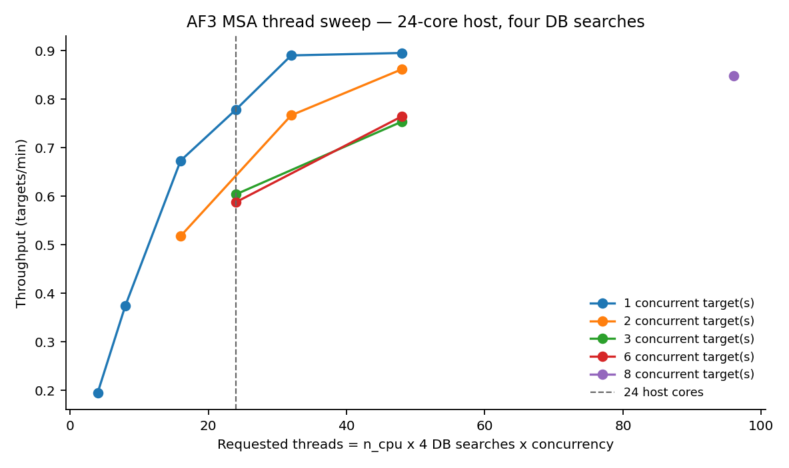

처리율은 총 스레드가 코어 수의 약 1.3배인 지점(24코어 호스트에서 48스레드)에서
**0.895 타깃/분으로 포화**하고 그 이상은 손해다 (24스레드 0.778, 32스레드 0.890,
96스레드 0.848). 측정 조건은 **전체 DB 급(4종 각 4GB 슬라이스) 기준**이다
(`results_example/msa_throughput.csv` 의 `db` 열). 축소 DB 약 2GB 에서는 데이터
파이프라인이 건당 1.98초로 훨씬 짧다.

권장값은 `--jackhmmer_n_cpu = --nhmmer_n_cpu = min(코어수/2, 8)`, 동시 1갈래다.
AF3 기본값이 `min(코어수, 8)` 이므로 **8코어 이상이면 기본값이 이미 최적에 가깝다.**

### 6-5. 진행 확인과 재개

스크립트는 `<이름>_work/` 에 상태를 남긴다.

```bash
cat vhh_001_work/state.json | python3 -m json.tool | head -30   # 진행 상태와 실패 목록
tail -5 vhh_001_work/run_summary.csv                            # 타깃별 건당 시간
tail -f vhh_001_work/*.log                                      # 컨테이너 stdout
ls vhh_001_out | wc -l                                          # 몇 건 끝났나
nvidia-smi --query-gpu=utilization.gpu,memory.used --format=csv -l 5
```

`utilization.gpu` 가 오르내리면 정상이고, `memory.used` 가 15GB 근처인 것도 정상이다
(XLA 선점량, [2절](#2-요구-사양)).

전원, 커널 OOM, SSH 연결 종료 등으로 중단되면 동일한 명령으로 재개한다. 이미 끝난
타깃은 건너뛴다. 미완성 결과 폴더는 스크립트가 `partial/` 로 옮겨 둔다
(그대로 두려면 `--keep-partial`). 실패한 것만 골라 다시 하려면 `--retry`,
처음부터 다시 계산하려면 `--no-skip` 이다. **2000건에 `--no-skip` 을 쓰면 처음부터
다시 돌린다.**

장시간 실행에는 `tmux new -s af3` 세션을 사용한다
(`Ctrl+B, D` 로 빠져나오고 `tmux attach -t af3` 로 다시 붙는다). 운영 절차 전체는
[docs/operations_guide.md](docs/operations_guide.md) 에 있다.

---

## 7. 속도 개선의 근거

### 7-0. full DB MSA 시간은 무엇이 정하는가

복합체(사슬 2개, 277잔기)는 사슬마다 MSA 를 돌므로 full DB 로 **69.8분** 걸렸다.

> **34.8분은 CPU 도 GPU 도 아니라 디스크가 정한 값이다.** full DB MSA 가 도는 동안
> 이 장비를 재 보면 GPU 1%(54°C, 210MHz 아이들), CPU 32코어 중 실질 3코어,
> iowait 7.4%, 그리고 HDD 가 152MB/s 로 읽으며 평균 대기 **287ms** 였다.
> jackhmmer 3개가 `--cpu 8` 을 받고도 같은 회전 디스크를 동시에 훑느라 서로
> seek 를 뺏는다. **full DB 를 NVMe 에 두면 이 표의 시간은 크게 달라진다.**
> 여기 숫자를 다른 장비 계획에 그대로 쓰면 안 된다.

**MSA 시간은 사슬 길이를 타지 않는다 (이 장비에서).** 같은 날 full DB 로 돌린
네 입력의 사슬 9개를 잔기 수 순으로 놓으면 이렇다.

| 잔기 | 73 | 116 | 116 | 129 | 129 | 138 | 148 | 340 | 350 |
|---|---|---|---|---|---|---|---|---|---|
| MSA (초) | 2109 | 2055 | 2262 | 2049 | 2061 | 2091 | 2066 | 2092 | 2105 |

73잔기와 350잔기가 같은 35분이다. 최대/최소 비가 1.10배이고, 그 편차는 같은 116잔기
두 건 사이(2055 vs 2262)에서도 나온다. 즉 jackhmmer 의 계산량이 아니라 **DB 를
디스크에서 한 번 읽어 오는 시간이 바닥값** 이고, 이 길이 범위에서는 계산이 그 바닥
아래에 묻힌다. 그래서 full DB 소요는 대략 **사슬 수 × 35분** 으로 잡으면 되고
(1사슬 34.8분, 2사슬 69.8분, 3사슬 106.9~107.9분), 사슬이 길다고 더 잡을 필요는
없다. 이보다 훨씬 긴 사슬(수천 잔기)에서는 확인하지 않았다.

JSON 하나마다 `docker run` 을 새로 띄우면 타깃마다 컨테이너 기동, JAX/CUDA 초기화,
가중치 로딩(1.15GB, 파라미터 3.68억 개), XLA 커널 컴파일을 처음부터 반복한다.
이 고정 비용이 건당 9.1~9.2초로 측정됐고, 버킷 128 에 들어가는 짧은 VHH 의 실제 추론은
정상상태 4.20초다.

A/B 실측 (32건 곱하기 3반복, MSA 없는 GPU 추론 경로만, 웜 캐시):

| 조건 | 건당 시간 | 최악 대비 |
|------|-----------|-----------|
| 프로세스별 + 캐시 미지정 (기존 방식) | 31.95초 | 1.00배 |
| 프로세스별 + 캐시 지정 | 18.13초 | 1.76배 |
| 단일 프로세스 + 캐시 미지정 | 6.26초 | 5.10배 |
| **단일 프로세스 + 캐시 지정 (권장)** | **5.39초** | **5.93배** |

세 번 반복한 값이 5.39 / 5.39 / 5.41초로 편차 0.1%였다.

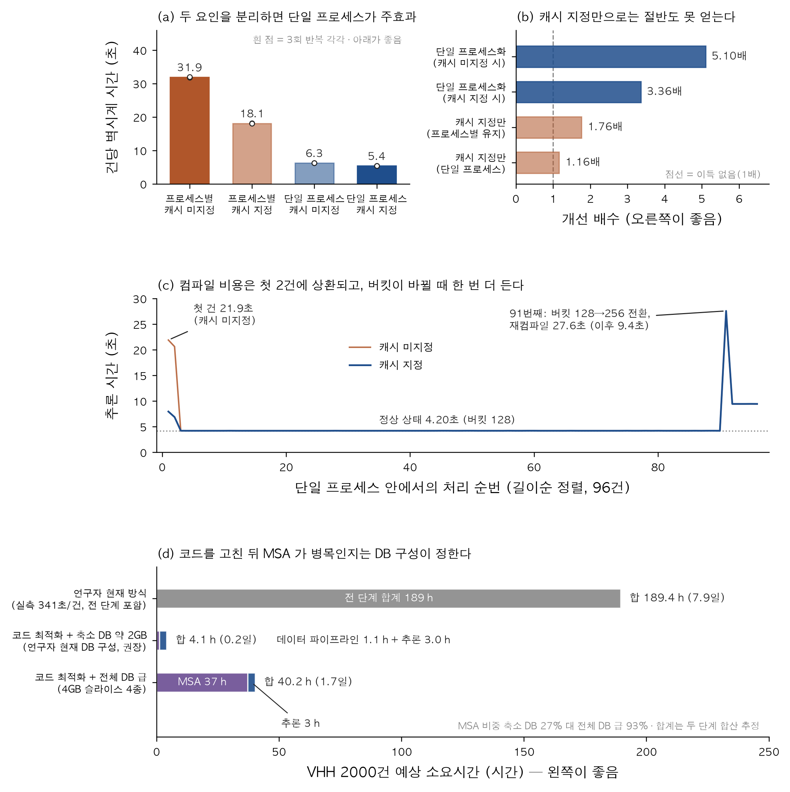

가장 큰 차이는 단일 프로세스화에서 나왔다. 캐시 미지정 조건에서 5.10배, 캐시 지정에서
1.76배 차이가 났다. 캐시 효과는 첫 두 입력의 컴파일 이후 줄어든다. 길이순 정렬의 이득은
측정상 0.00초/건이었다.

GPU 단계를 고치면 다음에 무엇이 남는지는 **1단계에 어떤 DB 를 쓰는가**에 달려 있다.
아래 두 구성은 조건이 달라 직접 비교할 수 없다.

| 구성 | 데이터 파이프라인(MSA) 건당 | GPU 추론 건당 | 2000건 합계 | MSA 비중 | 근거 |
|---|---|---|---|---|---|
| 역사적 축소 sequence DB | 1.98초 | 5.39초 | **4.1시간** | 27% | 서로 다른 실험의 건당 값을 합친 cross-experiment 투영 |
| 전체 DB 급 4GB 슬라이스 4종 | 67.0초 (스레드 스윕 포화점) | 5.39초 | **40.2시간 (1.7일)** | 93% | MSA 인용, 추론 직접측정, 합계는 합산 추정 |

**축소 DB 구성에서는 MSA 가 병목이 아니다.** 데이터 파이프라인 1.98초가 GPU 추론
5.39초보다 짧다. **MSA 가 93%를 차지하는 것은 전체 DB 급 구성에서만 성립하고**, 조건을
빼고 "코드를 고치면 MSA 가 93%" 라고 쓰면 틀린 말이 된다.

연구자의 현재 방식은 건당 341초, 2000건 189시간(7.9일)이었다. 직접 측정된 개선은
GPU 추론 단계의 **5.93배**다. 189시간과 서로 다른 조건의 4~40시간 투영을 나눈
**4.7~46배는 산술 시나리오 범위이며 end-to-end로 검증한 개선 배수가 아니다.**

> `341 / 5.39 = 63배` 같은 계산은 성립하지 않는다. 341초에는 MSA 가 포함돼 있고
> 5.39초에는 포함돼 있지 않으므로 end-to-end 시간 계산에는 적용하지 않는다.

측정 원자료와 조건별 대조는 [docs/benchmark_report.md](docs/benchmark_report.md),
[docs/diagnosis_report.md](docs/diagnosis_report.md),
[docs/msa_correction_notes.md](docs/msa_correction_notes.md) 에 있다.

---

## 8. 결과 해석

신뢰도 수치만으로 구조 정확도를 확정할 수 없다. 수치 해석과 [구조 확인](#9-결과-보기)을 함께 수행한다.

### 8-1. 출력 폴더의 구성

타깃 하나가 폴더 하나가 되고 폴더 이름은 입력 JSON 의 `name` 을 정규화한 값이다.
아래는 검증 호스트의 실제 출력이다 (VHH 단량체, sample 5).

```
vhh_001_out/vhh_4qgy_1/
    vhh_4qgy_1_model.cif                     95,280 B   1위 모델 구조
    vhh_4qgy_1_summary_confidences.json       1,209 B   1위 모델의 요약 지표
    vhh_4qgy_1_confidences.json             161,061 B   원자별 pLDDT, 토큰별 PAE
    vhh_4qgy_1_ranking_scores.csv               147 B   시드 곱하기 샘플 전체의 점수
    vhh_4qgy_1_data.json                    839,761 B   MSA 가 담긴 입력
    TERMS_OF_USE.md                          13,036 B   AF3 가 넣는 약관
    seed-1_sample-0/ ... seed-1_sample-4/               샘플별 동일 3종 파일
```

| 파일 | 무엇이 들어 있나 | 언제 쓰나 |
|------|------------------|-----------|
| `*_model.cif` | 1위 모델의 원자 좌표. mmCIF 의 `B_iso_or_equiv` 열이 원자별 pLDDT (0~100) | 구조를 눈으로 볼 때. 뷰어에 이 파일을 넣는다 ([9절](#9-결과-보기)) |
| `*_summary_confidences.json` | ranking_score, ptm, iptm, fraction_disordered, has_clash, 체인별 지표 | 이 타깃을 통과시킬지 판단할 때 |
| `*_confidences.json` | 원자별 pLDDT 배열, 토큰 쌍별 PAE 행렬, 토큰별 체인 ID | 어느 부위가 못 맞았는지 볼 때 |
| `*_ranking_scores.csv` | `seed,sample,ranking_score` 한 줄씩 (sample 5면 5줄) | 결과가 우연인지, 샘플 간 산포를 볼 때 |
| `*_data.json` | MSA(`unpairedMsa`, `pairedMsa`)와 템플릿이 문자열로 담긴 **재사용 가능한 입력** | MSA 깊이를 볼 때. `--norun_data_pipeline` 재실행에 그대로 쓴다 ([6-4](#6-4-2단계-전략-msa-먼저-추론-나중)) |
| `seed-*_sample-*/` | 샘플 하나의 `_model.cif` 와 신뢰도 2종 | 샘플 간 구조를 직접 비교할 때 |

타깃 폴더 바로 아래의 파일은 AF3가 선택한 1위 모델이며 기본 구조 검토 대상이다.

출력 폴더가 이미 있고 비어 있지 않으면 AF3 는 `<폴더명>_<타임스탬프>` 형제 폴더를
새로 만든다. 그때도 **파일 stem 은 원래 타깃명 그대로**이므로 집계 스크립트는 타깃을
정상적으로 인식한다.

**폴더가 있다는 것은 완료를 뜻하지 않는다.** AF3 는 추론 *전에* `_data.json` 을 쓴다.
완료 기준은 `_ranking_scores.csv`, `_model.cif`(또는 `.cif.zst`),
`_summary_confidences.json` 세 개가 모두 있고 크기가 0보다 클 때다.
`run_af3_batch_improved.py` 가 이 기준으로 판정한다.

### 8-2. 지표의 정의

| 지표 | 범위 | 무엇 | 어디 |
|------|------|------|------|
| **pLDDT** | 0~100 | **잔기/원자 단위 국소 정확도** | `*_confidences.json`, `*_model.cif` 의 B-factor |
| **pTM** | 0~1 | **예측된 TM-score.** 정답일 확률이 아니다 | `*_summary_confidences.json` |
| **ipTM** | 0~1 | **계면 정확도.** 복합체에서만 산출 | 같음 |
| **PAE** | Å | **토큰 쌍별 위치 오차 기댓값** | `*_confidences.json` |
| **ranking_score** | 해당 없음 | AF3 가 모델을 줄 세울 때 쓰는 종합 점수 | `*_summary_confidences.json` |
| **fraction_disordered**, **has_clash** | 0~1, 0/1 | 무질서 비율, 원자 충돌 발생 | 같음 |

pLDDT 평균은 집계 단위를 확인해야 한다. `af3_collect.py`의 `pLDDT평균`과 등급 판정은
`atom_plddts` 전체의 원자 가중 평균이다. `af3_visualize.py`의 표에는
`mean_atom_plddt`와 `mean_residue_plddt`가 따로 있고, 요약 비교 그림은 집계 CSV와 같은
원자 평균을 쓴다. 잔기별 꺾은선과 3D 뷰어는 각 잔기에 같은 가중치를 준 잔기 평균을 쓴다.
현재 Docker 스모크에서는 두 값이 각각 92.67과 93.31이었다. 계산 오류가 아니라 가중치
차이다. 시각화 표의 기존 `mean_plddt`와 `min_plddt` 열은 호환성을 위해 잔기 지표 별칭으로
남아 있다.

### 8-3. 판정 기준선

`af3_collect.py` 가 CSV 의 `등급` 열에 쓰는 기준이고, AlphaFold 계열의 통상적 해석
구간을 이 배치에 맞춰 적용한 것이다.

| 지표 | 구간 | 해석 |
|------|------|------|
| pLDDT | 90 이상 | 매우 높음. 측쇄 수준까지 신뢰 |
| | 70~90 | 신뢰. 주사슬(백본) 신뢰 |
| | 50~70 | 낮음. 접힘 방향 정도만 |
| | 50 미만 | 매우 낮음. 구조가 없거나 무질서 영역 |
| pTM | 0.5 초과 | 탐색용 경험적 구간. 정답 구조 보증선이 아니다 |
| ipTM (복합체만) | 0.8 이상 | 계면 신뢰 |
| | 0.6~0.8 | 회색지대. 판단 보류 |
| | 0.6 미만 | 계면 실패 가능성 높음 |

**복합체는 ipTM 을 1차 기준으로 쓴다.** 단량체는 ipTM 이 없으므로 pLDDT 와 pTM 을
함께 본다. `등급` 열은 복합체에서 `A_계면신뢰`(ipTM ≥ 0.8 이고 pLDDT평균 ≥ 80),
`B_계면회색`(ipTM ≥ 0.6), `C_계면실패`(그 외)이고, 단량체에서
`A_높음`(pLDDT평균 ≥ 90 이고 pTM ≥ 0.7), `B_신뢰`(pLDDT평균 ≥ 80 이고 pTM ≥ 0.5),
`C_보통`(pLDDT평균 ≥ 70), `D_낮음`(그 외)이다.

등급과 별개로 `경고` 열이 붙는다. `충돌`(has_clash > 0, 원자 중첩 구조 확인 필요),
`무질서`(fraction_disordered ≥ 0.1), `MSA얕음`(unpaired 깊이 < 100.
축소 DB 를 쓰면 정상적으로 붙는다), `샘플불안`(ranking 산포 ≥ 0.05. 샘플마다 결과가
흔들려 재현성이 낮다), `버킷256`(패딩 버킷 ≥ 256. 더 큰 연산 구간이라는 표시)이다.
2.25배는 이 컴퓨터에서 버킷 128과 256을 비교한 값이며 다른 버킷이나 장비에 그대로
적용하지 않는다.

> ### 주의 1. 신뢰도는 정답과의 일치도가 아니다
>
> pLDDT, pTM, ipTM, ranking_score는 모델 내부의 예측 신뢰도이며
> **실제 구조와의 일치도를 직접 측정하지 않는다.** 특히 학습 데이터에
> 유사 구조가 많은 계열(면역글로불린 폴드가 이에 해당한다)은 프레임워크 부분의 pLDDT가
> 항상 높게 나오는데 그게 CDR 루프의 배치가 맞다는 뜻은 아니다. **이 값들은 실험 검증
> 대상을 줄이는 순위 지표로만 쓰라.** "pLDDT 92니까 이 구조가 맞다" 는 결론은 이
> 데이터로 낼 수 없다.

> ### 주의 2. ranking_score는 단독 순위 기준으로 사용하지 않는다
>
> AF3 의 정의는 `0.8 x (ipTM 또는 단량체면 pTM) + 0.2 x pTM +
> 0.5 x fraction_disordered - 100 x has_clash` 다. **`fraction_disordered` 를 더하므로**
> 무질서 비율이 높은 건이 pTM 이 더 낮아도 ranking_score 는 더 높게 나올 수 있다.
> 이 점수는 원래 같은 타깃의 여러 샘플 중 대표를 고르기 위한 것이고 **서로 다른 타깃을
> 줄 세우는 용도가 아니다.**
>
> 스크리닝 순위에는 **pTM(단량체) 또는 ipTM(복합체)과 pLDDT평균을 함께** 사용한다.
> `af3_collect.py` 의 `--top-by` 로 기준 열을 바꿀 수 있다. CSV 의 `ranking검산차` 열은
> 위 식으로 다시 계산한 값과의 차이이고, **0 근처가 아니면 파일 짝이 안 맞는다**
> (다른 실행의 파일이 섞였다).

### 8-4. `af3_collect.py` 로 표 만들기

출력 폴더에서 타깃별 지표를 읽어 CSV로 모은다. 표준 라이브러리만 쓰므로
pandas 가 없는 서버에서도 돌아간다 (python 3.8 이상). **읽기만 하고** 출력 폴더의 어떤
파일도 수정하거나 삭제하지 않는다.

```bash
python3 scripts/af3_collect.py vhh_001_out -o vhh_001_결과요약.csv    # 기본

# MSA 깊이 계산은 *_data.json 을 읽어야 해서 느리다. 필요 없으면 끈다
python3 scripts/af3_collect.py vhh_001_out --no-msa-depth -o 요약.csv

# 여러 폴더를 한 CSV 로 (조건 비교). 라벨=경로 형식
python3 scripts/af3_collect.py 축소=af3out_reduced 전체=af3out_full -o 비교.csv

# 상위 100건 골라내기 (2단계 전략의 재실행 목록). 기준 열은 --top-by 로 바꾼다
python3 scripts/af3_collect.py vhh_001_out --top 100 --top-by pTM --top-list top100.txt

python3 scripts/af3_collect.py vhh_001_out --grade-doc                # 등급 기준 설명
```

CSV 는 35열이다. `조건, 타깃, 등급, 경고`, 신뢰도(`ranking_score, pTM, ipTM,
원자 가중 pLDDT평균/중앙값/최소/p10/70이상비율/90이상비율, fraction_disordered, has_clash`),
MSA(`MSA_unpaired깊이, MSA_paired깊이`), 규모(`토큰수, 원자수, 체인수, 체인ID,
패딩버킷`), 샘플 산포(`샘플수, ranking최고/최저/산포`), 체인별
(`chain_pTM, chain_ipTM, min_chain_pair_ipTM`), 검산(`ranking검산차`), 그리고 출처
(`출력경로, 폴더명, 실행시각, 실행수, 중복정책`)다. 여러 번 실행해 타임스탬프 폴더가
생겼으면 `--all-runs` 로 전부 집계할 수 있다. `-o`를 생략했을 때 기본 CSV 파일명을
ASCII로 만들려면 `--filename-lang en`을 준다. 이 옵션은 파일명만 바꾸며 CSV 열 이름은
바꾸지 않는다.

실행하면 화면에 이렇게 요약이 뜬다 (검증 호스트 실물 출력, 축소 DB 6종).

```
축소  ~/af3_db_track/af3out_reduced : 완료 6건, 미완성/건너뜀 0건
집계 완료: 6건 -> out.csv
  A_높음            2건 (33.3%)
  B_신뢰            4건 (66.7%)
  경고: MSA얕음 6건, 버킷256 4건, 무질서 1건
  ranking_score 검산: 전건 일치 (파일 짝이 맞다)
```

2026-08-21 Docker 스모크 결과는 다음처럼 읽었다.

| 등급 | ranking score | pTM | pLDDT 평균 | MSA unpaired / paired | tokens / bucket | ranking 범위(최고-최저) |
|------|---------------|-----|------------|-----------------------|-----------------|-----------|
| A_높음 | 0.90 | 0.90 | 92.67 | 10,640 / 24,469 | 116 / 128 | 0.0023 |

단량체 접힘에 대한 모델 신뢰도가 높고 다섯 샘플도 안정적이라는 뜻이다. 단량체라 ipTM은
없으며 0으로 해석하지 않는다. 이 값만으로 결합, 활성, 실험 구조 일치를 주장할 수는 없다.

`ranking_score 검산`이 전건 일치인지 확인한다. 불일치는 서로 다른 실행의 파일이 섞였을
가능성을 뜻한다.
실제 출력 예시는 [results_example/af3_summary.csv](results_example/af3_summary.csv)
(축소 DB 대 전체 DB 6종 비교, 실측)에 있다. 현재 35열 형식으로 맞췄으며, 과거 실행에서
시각을 따로 보존하지 않아 `실행시각`은 비어 있다.

### 8-5. 검토 순서

1. `등급` 열로 정렬한다. `D_낮음` 은 일단 제외한다.
2. `경고` 열에 `충돌` 이 있는 건은 구조를 직접 열어 확인한다.
3. `경고` 열에 `샘플불안` 이 있는 건은 재현성이 낮으니 시드를 늘려 재실행한다.
4. 남은 것을 pTM(또는 ipTM) 내림차순 + pLDDT평균 으로 정렬한다.
5. 상위 수십 건만 구조를 실제로 눈으로 본다 ([9절](#9-결과-보기)).
6. 그중에서 실험할 것을 고른다.

`MSA얕음` 경고는 축소 DB 를 썼으면 전량에 붙는다. 단량체 스크리닝에서는 정상이다
([3-5](#3-5-데이터베이스-선택) 의 6종 비교).

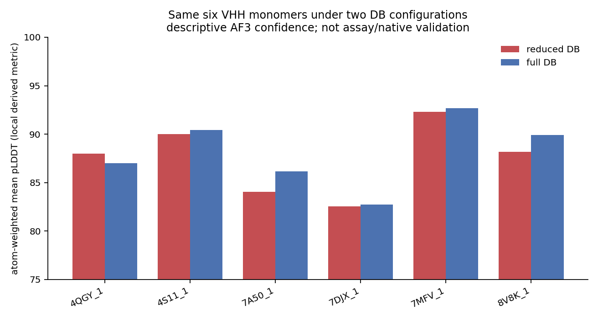

> 위 그림은 **이 저장소가 측정해 둔 12건 분석**이고, `af3_visualize.py` 가 만드는
> 파일이 아니다. 파일명이 같지만 도구는 왼쪽에 ranking score 순위, 오른쪽에
> 신뢰도 산점도를 담은 **2패널** 그림을 만든다. 위 그림은 단량체 12건이라 pTM 을
> 축으로 쓰고, 복합체에서는 도구가 ipTM 을 축으로 쓴다.

---

## 9. 결과 보기

### 9-1. `af3_visualize.py`: 그림 만들기

먼저 [3-9절](#3-9-결과-그림용-python-환경)의 분리 환경이 준비됐는지 확인한다. 단일
설치기를 사용했다면 이미 설치돼 있다. 세부 옵션은
`~/af3_plot_env/bin/python scripts/af3_visualize.py --help`로 확인한다.

```bash
~/af3_plot_env/bin/python scripts/af3_visualize.py vhh_001_out/vhh_A01 -o figs  # 타깃 하나
~/af3_plot_env/bin/python scripts/af3_visualize.py vhh_001_out -o figs          # 폴더 전체
```

**pLDDT 프로파일**(잔기별 꺾은선)에서 낮게 파인 구간은 신뢰도가 낮은 부위다. VHH에서는 CDR3
근처가 낮은 게 흔하다. **PAE 히트맵**(토큰 곱하기 토큰)에서 대각 블록은 도메인 내부이고,
복합체에서 사슬 A 와 B 에 해당하는 대각 밖 블록이 어두우면(오차 작음) 두 사슬의 상대
위치를 확신한다는 뜻이다. 밝으면(오차 큼) 각 사슬은 잘 접혔지만 **어떻게 붙는지는
모른다**는 뜻이고, ipTM 이 낮은 복합체는 대개 이 모양이다.

이 스크립트는 뷰어용 색칠·정렬 명령을 타깃 이름에 맞춰 생성해 주기도 한다
(`examples/viewer_pymol_plddt.pml`, `examples/viewer_chimerax_plddt.cxc` 가 그 예시다).

### 9-2. `af3_view3d.py`: 브라우저 3D 뷰어

AF3 출력 폴더를 HTML로 만들어 브라우저에서 확인한다. 파일을 열면 구조를 회전·확대할 수 있다.
파이썬 표준 라이브러리만 사용하므로 추가 설치는 필요 없다.

```bash
# 타깃 하나만 본다
python3 scripts/af3_view3d.py vhh_001_out --only vhh_001 --out-dir 뷰어

# 출력 폴더 전체를 본다 (타깃별 HTML + 목록 index.html)
python3 scripts/af3_view3d.py vhh_001_out --out-dir 뷰어

# 2000건을 돌린 뒤 상위 20건만 자세히 본다
python3 scripts/af3_view3d.py vhh_001_out --out-dir 뷰어 --top 20

# 인터넷이 안 되는 컴퓨터로 옮겨서 볼 것이면 (파일이 커진다)
python3 scripts/af3_view3d.py vhh_001_out --out-dir 뷰어 --lib embed --engine 3dmol
```

생성된 `뷰어/index.html`을 브라우저에서 연다.

### 9-3. 만들어지는 파일

| 파일 | 무엇인가 |
| --- | --- |
| `뷰어/index.html` | 타깃 목록. ranking score 내림차순. pTM, ipTM, 평균 pLDDT, 사슬 수, pLDDT 구간 분포 막대가 한 줄에 있다. 타깃 이름을 누르면 구조로 간다 |
| `뷰어/<타깃>.html` | 구조 하나. 왼쪽에 신뢰도 지표와 색 범례, 오른쪽에 3D 화면 |

`--lib cdn` (기본)이면 HTML 이 작고 열 때 인터넷이 필요하다. `--lib embed` 면
3D 라이브러리가 파일 안에 들어가서 인터넷 없이 열리는 대신 파일이 커진다.
크기는 구조가 클수록 커진다 (mmCIF 가 파일 안에 들어간다).

| 만드는 법 | 단량체 116잔기 | 복합체 277잔기 |
|---|---|---|
| `--lib cdn` (기본) | 0.13 MB | 0.27 MB |
| `--lib embed` (Mol\*) | 4.99 MB | 5.13 MB |
| `--lib embed --engine 3dmol` | 0.64 MB | 0.78 MB |

이 장비 2026-08-25 실측이다. 인터넷 없이 많은 결과를 열 때는
`--engine 3dmol --lib embed`를 사용한다.

CDN URL은 version과 SRI가 고정돼 있고 embed 다운로드/cache는 SHA-256을 검사한다.
`--lib-file`은 일반 data가 아니라 사용자가 신뢰한 **실행 JavaScript**를 직접 제공하는
옵션이다. 생성기는 script-context escape, CSP, artifact symlink 거부, index 경로 제한과
출력 파일명 충돌 검사를 적용한다.

### 9-4. 화면 조작

- **돌리기**: 왼쪽 버튼으로 끌기
- **확대/축소**: 마우스 휠
- **평행 이동**: 오른쪽 버튼으로 끌기 (또는 휠 버튼)
- **pLDDT / 사슬별 버튼**: 색칠을 바꾼다. 즉시 바뀐다. 다시 만들 필요 없다
- **시점 초기화 버튼**: 처음 시점으로 복원한다

왼쪽에 ranking score, pTM, ipTM, 평균 pLDDT, 최저 pLDDT, 무질서 비율,
원자 충돌 여부, 사슬 수, 잔기/원자 수, 확산 샘플 수와 샘플 간 산포가 나온다.
ipTM 은 단량체에 없는 값이므로 단량체 화면에는 그 줄이 아예 없다 (0 이 아니다).

### 9-5. 색 해석

기본 색칠은 pLDDT 다. 잔기별 예측 신뢰도이고 0~100 이다. 경계와 색은 EBI
AlphaFold DB 와 같으므로 그쪽에서 본 그림과 나란히 비교할 수 있다.

| 색 | pLDDT | 뜻 |
| --- | --- | --- |
| 진한 파랑 | 90 이상 | 원자 위치까지 믿을 만하다 |
| 하늘색 | 70~90 | 뼈대는 맞다. 곁사슬 방향은 덜 확실하다 |
| 노랑 | 50~70 | 대략적인 위치만 해석하며 결론의 단독 근거로 사용하지 않는다 |
| 주황 | 50 미만 | 위치가 사실상 정해지지 않았다 |

**신뢰도가 높은 VHH 단량체**: 전체가 파랑/하늘색이고, 주황은 양쪽 끝
(N말단 1~2잔기, C말단 His-tag 등 꼬리)에만 있다. 그 꼬리가 낮은 것은 정상이다.
실제로 붙어 있지 않은 유연한 끝이라서 위치가 정해지지 않는 것이고, 결합에도
관여하지 않는다.

**CDR3 근처가 낮은 것은 흔하다**. VHH 의 CDR3 는 대략 95~115번 잔기 근처의
긴 루프다. 이 구간이 노랑까지 내려가는 것은 자주 보이고, 그 자체로 실패가 아니다.
루프는 원래 여러 모양을 오간다. 화면 왼쪽 아래 "pLDDT 70 미만 연속 구간" 목록에
신뢰도가 낮은 잔기 번호를 CDR3 범위와 대조한다.

**추가 검토가 필요한 형태**:
- 프레임워크(대략 1~25 / 35~50 / 60~95 / 115~끝)까지 노랑이나 주황이면
  면역글로불린 접힘이 형성되지 않았을 수 있으므로 입력 서열과 절단 여부를 확인한다
- 화면 왼쪽 목록의 "pLDDT 70 미만 연속 구간" 이 CDR 밖에서 10잔기 이상 이어진다
- 두 개의 베타 시트 샌드위치가 형성되지 않고 사슬이 길게 풀려 있다
- "무질서 비율" 이 0.3 을 넘는다
- "원자 충돌"이 "있다"로 표시된다
- 확산 샘플 간 ranking score 표준편차가 크다

**복합체(VHH + 항원) 확인 항목**: 사슬별 버튼으로 바꿔 어느 쪽이 VHH이고 어느 쪽이
항원인지 확인한다. pLDDT 색은 각 잔기의 국소 구조 신뢰도만 나타내므로 접촉면이
파랑/하늘색이어도 두 사슬의 상대 배치가 맞다는 뜻은 아니다. 상대 배치는 사슬 간 PAE
블록과 ipTM으로 판단한다. ipTM이 낮고 pTM이 높은 경우에는 개별 사슬 접힘보다 사슬 간
배치의 불확실성이 크다.

### 9-6. PyMOL / ChimeraX 로 보기

`*_model.cif` 를 뷰어에 넣는다. AF3 는 mmCIF 의 B-factor 자리(`B_iso_or_equiv`)에
원자별 pLDDT 를 넣으므로, 어느 뷰어에서든 그 값으로 색칠하면 신뢰도 지도가 된다.

**(a) PyMOL.** `pymol vhh_001_out/vhh_A01/vhh_A01_model.cif` 로 열고 명령창에 붙인다.

```python
spectrum b, red_yellow_green_blue, minimum=50, maximum=90
show cartoon
hide lines
bg_color white
select lowconf, b < 70        # 낮은 부위만 골라 본다
show sticks, lowconf
color orange, lowconf
```

빨강이 낮고(50 이하) 파랑이 높다(90 이상). AlphaFold 공식 배색과 방향이 다르니 그림에
범례를 포함한다. AlphaFold 관례(파랑=높음, 주황=낮음)는
`spectrum b, orange_yellow_cyan_blue, minimum=50, maximum=90` 이다.

**(b) ChimeraX.** `af3_visualize.py`가 만든 `viewer_chimerax_plddt.cxc`를 연다. 일부
ChimeraX 버전은 `palette alphafold`를 0~1 범위로 해석하므로, 생성된 파일은 pLDDT의
0~100 경계를 명시한 palette를 사용한다. `cartoon`, `set bgColor white`, 낮은 부위 선택
명령도 같은 파일에 들어 있다.

**구조 중첩.** 같은 계열 나노바디에서 CDR 루프만 다른지 확인할 때 PyMOL은
`load` 후 `align m2, m1`, ChimeraX 는 `open` 후 `matchmaker #2 to #1` 이다.
전체 스크립트는 `examples/viewer_pymol_plddt.pml` 과
`examples/viewer_chimerax_plddt.cxc` 에 있다.

### 9-7. 외부 웹 뷰어로 파일 하나 확인

결과 파일 하나는 외부 웹 뷰어에서도 확인할 수 있다.
<https://molstar.org/viewer> 를 열고 `<타깃>_model.cif` 파일을 화면에 끌어다
놓는다. 같은 뷰어이고 pLDDT 색칠도 그쪽 메뉴에서 고를 수 있다
(Color Theme 를 pLDDT Confidence 로).

외부 웹 뷰어는 파일을 외부 서비스에 업로드한다. 미공개 서열이거나
미공개 후보나 특허 검토 대상에는 외부 웹 뷰어를 사용하지 않는다. 이 저장소의
`af3_view3d.py`로 만든 HTML은
파일이 컴퓨터 밖으로 나가지 않는다 (`--lib embed` 로 만들면 열 때 네트워크
연결조차 하지 않는다).

### 9-8. 구조가 표시되지 않을 때

- **"구조를 표시하지 못했다" 안내가 나온다**: `--lib cdn` (기본)으로 만든 파일은
  열 때 인터넷에서 3D 라이브러리를 가져온다. 인터넷이 없거나 사내망이 막았으면
  이 화면이 나온다. `--lib embed` 로 다시 만들면 인터넷 없이 열린다
- **인터넷이 되는데도 같은 안내가 나온다**: 2026-08-21~24 사이에 만든 HTML 은
  페이지의 보안 정책(CSP)이 3D 라이브러리를 막아 구조가 뜨지 않는다. 그 기간의
  파일이면 `af3_view3d.py` 를 최신으로 받아 **다시 만들면** 된다. 지금 버전은
  이런 경우 안내문이 "원인은 인터넷이 아니라 CSP 다" 라고 직접 알려 준다
- **"mmCIF 가 .cif.zst 압축이고 풀지 못했다"**: AF3 를
  `--compress_large_output_files` 로 돌린 결과다. `python3 -m pip install zstandard`
  를 사용하거나 `zstd -d <파일>_model.cif.zst`로 압축을 푼 뒤 다시 생성한다
- **목록에 타깃이 없다**: 완료 판정은 `_ranking_scores.csv`, `_model.cif`(또는
  `.cif.zst`), `_summary_confidences.json` 세 개가 모두 있고 크기가 0보다 큰
  것이다. 추론이 끝나지 않은 폴더는 빠진다. 그런 폴더도 보려면 `--include-partial`

### 9-9. 구조 확인 항목

| 볼 것 | 정상 | 이상 |
|-------|------|------|
| 전체 폴드 | 면역글로불린 β-샌드위치가 보인다 | 풀린 사슬, 뭉친 덩어리 |
| CDR 루프 | 루프 형태가 잡혀 있다 | 곧게 뻗어 있고 pLDDT도 낮다 |
| 사슬 말단 | 몇 잔기 흔들리는 것은 정상 | 긴 구간이 무질서 |
| 복합체 계면 | 두 사슬이 실제로 접촉해 있다 | 떨어져 있거나 엉뚱한 면끼리 붙어 있다 |
| 원자 충돌 | 없음 | `has_clash > 0` 이면 여기를 확인 |

복합체 계면 형태와 ipTM이 일관되는지 대조한다. 값이 어긋나면 서로 다른 실행의 파일이
섞였는지 확인한다
([8-3](#8-3-판정-기준선) 의 `ranking검산차`).

---

## 10. 자주 만나는 문제

| 증상 | 원인 | 해결 |
|------|------|------|
| JSON 입력에서 UTF-8 디코딩 또는 파싱 오류가 발생한다. `ls`에서는 원인이 보이지 않는다 | macOS에서 만든 `tar.gz`를 Linux에서 풀 때 생기는 AppleDouble 사이드카 `._*.json`. `glob('*.json')`에 포함되지만 UTF-8이 아니다 | `find <입력폴더> -name '._*' -delete`. 아래 상세 항목 참고 |
| `nvidia-smi` 가 15,157 MiB 사용 중이라고 나온다 | XLA 선점량. 수요가 아니다. 실제 피크는 2,942~2,963 MiB | 선점량으로 해석한다. 실제 사용량 측정에는 `--no-prealloc`을 사용한다(속도 저하 가능) |
| 진짜 `CUDA out of memory` | 토큰 수가 크다. 버킷 1024 이상에서 급격히 커진다 | 아래 상세 항목의 5단계 순서 |
| `docker: permission denied ... daemon socket` | 사용자가 `docker` 그룹에 없다 | `sudo usermod -aG docker $USER` 후 재로그인. 또는 `--docker 'sudo docker'` |
| 첫 실행이 5~8분 걸린다 | XLA 커널 컴파일. 콜드/고부하에서 406~497초 관측 | 정상이다. 두 번째부터 웜 6.55~8.5초 ([3-8](#3-8-첫-실행-지연)) |
| `run_alphafold.py: error: unrecognized arguments: --input_dir` | 도커 이미지가 오래된 AF3 다 | 이미지를 다시 빌드한다. 아래 상세 항목 참고 |
| 결과 CSV 의 `패딩버킷` 이 256이다 | 사다리에서 128이 빠졌거나, 서열이 128 토큰보다 길다(130 aa는 정상적으로 256) | 기본 버킷 사다리를 사용한다. 직접 지정할 때는 128을 첫 항목으로 둔다([6-3](#6-3-af3_batchpy-직접-쓰기)) |
| `MSA얕음` 경고가 전량에 붙는다 | 축소 DB 를 쓰면 unpaired 깊이가 9~13 이다 | 단량체 스크리닝에서는 정상. **복합체라면 무시하지 말고 전체 DB 를 쓰라** |
| MSA 단계에서 CPU 를 늘렸는데 안 빨라진다 | 처리율이 코어 수의 약 1.3배에서 0.895 타깃/분으로 포화한다 (전체 DB 급 기준) | 정상이다. `--msa-workers` 를 올리면 손해다 ([6-4](#6-4-2단계-전략-msa-먼저-추론-나중)) |
| `jackhmmer -h` 에 `--seq_limit` 이 없다 | AF3 가 패치한 HMMER 가 아니다 | 도커 이미지를 쓰면 보통 문제없다. conda 설치면 [docs/install_log.md](docs/install_log.md) |
| AF3 설치 시 python 3.11 이 거부된다 | AF3 가 `requires-python >=3.12` | `conda create -y -n af3 python=3.12` |
| `/usr/include/zlib.h` 없음, sudo 불가 | 시스템 zlib 개발 헤더가 없다 | `conda install -y -c conda-forge zlib cmake` 후 `export CMAKE_PREFIX_PATH=$CONDA_PREFIX` |
| 중간에 끊겼는데 어디까지 됐는지 모른다 | | `cat <이름>_work/state.json`, `ls <이름>_out \| wc -l`. 같은 명령을 다시 실행하면 끝난 것은 건너뛴다 |
| JAX 캐시에서 `PERMISSION_DENIED` 가 수천 줄 나온다 | 예전 러너(root 컨테이너)가 만든 `~/af3_cache` 가 남아 있다. 지금 러너는 호출한 사용자로 돌아서 그 폴더에 못 쓴다 | `sudo chown -R $USER:$USER ~/af3_cache`. 러너가 이 상황을 감지하면 경고를 띄우고 캐시 없이 계속 진행한다(결과는 같고 첫 입력만 느려진다) |
| 결과 파일이 root 소유라 지울 수 없다 | 2026-08-25 이전 러너로 돌렸다. 컨테이너에 `--user` 를 안 넘겨서 docker 데몬(root)이 쓴 파일이 root 소유가 됐다. `sudo docker` 와 무관하게 생긴다 | `sudo chown -R $USER:$USER <결과폴더>` 로 한 번 정리하고 러너를 최신으로 받는다. 지금 러너는 호출한 사용자의 uid:gid 로 컨테이너를 돌려 결과가 본인 소유로 남는다 |

아래 세 항목은 별도 설명이 필요한 문제다.

### AppleDouble 사이드카 (`._*.json`)

> 이 문제로 3시간 측정이 실패한 사례가 있다.

macOS 에서 만든 `tar.gz` 를 리눅스에서 풀면 `foo.json` 옆에 `._foo.json` 이 생긴다.
`ls` 에서는 눈에 잘 안 띄고, `glob('*.json')` 에는 잡히고, 내용이 macOS 리소스 포크
바이너리이므로 텍스트 입력으로 읽으면 처리가 중단된다. 이 저장소의 스크립트
(`af3_batch.py`, `af3_collect.py`)는
`._` 파일을 건너뛰지만 AF3 본체가 읽을 수 있으므로 실행 전에 삭제한다.

```bash
find vhh_001_in -name '._*' | wc -l                     # 확인
find vhh_001_in -name '._*' -delete                     # 해결
COPYFILE_DISABLE=1 tar czf inputs.tar.gz vhh_001_in      # 예방 (macOS 에서 tar 만들 때)
find . -name '._*' -delete && find . -name '.DS_Store' -delete   # 리눅스에서 풀고 나서
```

### CUDA OOM (out of memory)

VHH 단량체에서는 드물며 큰 복합체나 긴 서열에서 발생한다. 다음 순서로 조정한다.
먼저 결과 CSV의 `토큰수`와 `패딩버킷`을 확인한다. 버킷 1024 이상에서는 메모리 요구량이
빠르게 증가한다. 그다음 `--diffusion-samples`를 5에서 1로 줄이고, `--no-prealloc`로
선점을 끈다. `--unified-memory`는 GPU 메모리 초과분을 시스템 RAM으로 넘기는 마지막
선택지이며 속도가 느려질 수 있다. 그래도 부족하면 입력을 나누거나 더 큰 GPU를 사용한다.

```bash
python3 scripts/af3_batch.py --name big --stage infer --no-prealloc --unified-memory
```

### `--input_dir` 를 모른다는 오류 (구버전 이미지)

이 저장소의 최적화는 `--input_dir` 로 한 프로세스가 전수 순회하는 것에 기반하므로 이게
없으면 핵심 이득을 못 얻는다. `git fetch --all` 후 확인된 커밋으로 `git checkout` 하고
이미지를 다시 빌드한다([3-2](#3-2-ubuntu-단일-설치기)). 즉시 재빌드할 수 없으면
캐시 디렉터리를 지정한다. 이 설정만으로 31.95초에서 18.13초(1.76배)로 줄었다.
단일 프로세스화(5.10배)는 포기해야 한다.

---

## 11. 라이선스와 인용

라이선스가 세 갈래로 나뉜다. **이 저장소의 스크립트와 문서**는 Apache 2.0
([LICENSE](LICENSE))이라 자유롭게 쓰고 고치고 재배포할 수 있고, **AF3 소스 코드**도
Apache 2.0(별도 저장소)이지만, **AF3 모델 가중치는 비영리 한정이고 재배포가 금지**돼
있다. **세 개는 서로 다르다.** 이 저장소가 Apache 2.0 이라는 것이 AF3 가중치를 자유롭게
쓸 수 있다는 뜻이 아니다.

AF3 가중치 제약은 네 가지다. **비영리 목적으로만** 쓸 수 있고, **재배포가 금지**돼
있으며(클라우드 공유 폴더, 사내 스토리지, 깃 저장소, 어디에도 올리면 안 된다),
**출력물로 유사 구조예측 모델을 학습시키는 것이 금지**돼 있고, 약관은 **구글로부터 직접
받은 경우만** 사용을 허용한다. 동료에게 복사해 받으면 위반이다.

신청서나 승인 절차는 없다. 약관 원문(97d2023 기준)은 **가중치를 사용하는 행위 자체가
동의**라고 정한다. 그러므로 절차는 이렇게 된다. **본인이 직접 위 URL 에서 내려받고,
받기 전에 약관을 읽는다.** 내려받은 날짜와 그때의 약관 판본을 기록해 두면 나중에 논문
심사나 기관 감사에서 근거가 된다.

정확한 조건은 Google DeepMind가 배포하는 약관 원문을 기준으로 한다. 위 내용은 요약이며
법적 효력은 원문에 있다. 더 자세한 정리는
[docs/license_notes.md](docs/license_notes.md).

AF3 를 써서 결과를 발표하면 다음을 인용해야 한다. 이 저장소는 인용할 필요가 없고,
필요하면 URL 을 각주로 넣으면 된다.

> Abramson, J., Adler, J., Dunger, J. et al. Accurate structure prediction of
> biomolecular interactions with AlphaFold 3. *Nature* **630**, 493–500 (2024).

> ### 저장소에 포함하지 않는 파일
>
> 이 저장소는 비공개로 운영하지만 다음 파일은 Git에 추가하지 않는다.
>
> - 모델 가중치 `af3.bin`, `af3.bin.zst`
> - `build_data`가 생성하는 `ccd.pickle`
> - `public_databases*/` 아래의 DB와 압축본
> - `*_out/` 결과와 실제 연구 FASTA/CSV/JSON
>
> `.gitignore`는 새 파일만 차단하며 이미 추적 중인 파일에는 적용되지 않는다. 커밋 전에는
> `git status`, `git diff --cached --stat`, `du -sh .git`으로 대용량·민감 파일 포함 여부를
> 확인한다. push 후 발견한 경우에는 파일 삭제 커밋만으로 과거 이력이 지워지지 않으므로
> 저장소 관리자와 이력 정리 범위를 결정한다.
>
> `examples/`의 서열은 공개 PDB 유래 예시이며 실제 연구 서열이 아니다.

---

## 12. 측정 조건과 한계

측정 호스트는 gpu-5070ti 다. **RTX 5070 Ti 16GB**(Blackwell sm_120), 24 코어, RAM
126GB, AF3 commit `97d20234c6eb89e8d05376e9eecc9321e60a559b`, 그리고 설치 방식은
**conda 네이티브였다. 이 호스트에 Docker 가 없었다.**

**과거 계획 환경과 다른 점.** RTX 5090 32GB Docker 실행은 계획값이었고 실제 측정하지
않았다. 따라서 5090 절대 시간이나 Docker 개선 배수는 보증하지 않는다.

### 2026-08-20 현재 PC native 재검증

현재 PC는 RTX 3080 Ti 12GB, driver 595.84, Python 3.12.14, JAX/jaxlib 0.10.2,
AF3 commit `97d20234c6eb89e8d05376e9eecc9321e60a559b`의 native 환경이다.

- JAX가 `CudaDevice(id=0)`, backend `gpu`로 인식했다.
- 공식 `run_alphafold_data_test.py`: 7/7 통과.
- 공식 `run_alphafold_test.py`: 기본 설정에서 17개 중 16개 통과. 유일한 실패는
  1024-token stress의 3.06GiB 추가 할당 OOM이었다.
- 같은 1024-token test를 공식 저메모리 설정
  (`TF_FORCE_UNIFIED_MEMORY=true`, `XLA_CLIENT_MEM_FRACTION=3.2`)으로 재실행해 통과했다
  (inference 176.12초, 전체 188.36초).
- 116-token VHH, MSA 없음, sample 1, recycle 1, Triton smoke는 inference 16.12초,
  전체 32.91초에 완료됐고 정식 산출물 3종과 집계·그림·Mol*/3Dmol HTML을 모두 만들었다.
- 같은 VHH를 공식 full DB, sample 1, recycle 1로 end-to-end 실행해 36분 41.8초에
  완료했다. 최종 MSA 깊이는 unpaired 10,640 / paired 24,469였고 ranking score 0.91,
  pTM 0.91, 원자 pLDDT 평균 93.15였다. 이 시간은 sample 5 / recycle 10 조건과 직접
  비교하지 않는다.
- 설치된 full DB는 압축본을 보존한 상태로 850GiB이며, 압축 223GiB, 해제본 약
  627GiB, mmCIF 234GiB,
  mmCIF 파일 195,858개다. `af3_db.py verify`의 필수 9항목을 모두 통과했다.

### 2026-08-21 현재 PC Docker 재검증

같은 PC에 Docker Engine 29.7.2와 NVIDIA Container Toolkit 1.20.0을 공식 APT 저장소로
설치했다.

- `hello-world`와 NVIDIA 공식 GPU 확인 컨테이너가 통과했다.
- 공식 AF3 이미지는 첫 빌드에 약 34분이 걸렸다. 로컬 unpacked 이미지는 15.5GB,
  빌드 캐시는 24.0GB였고 `docker image inspect` 크기는 4,699,381,677 B였다.
- 이미지 안의 AF3 3.0.4, JAX GPU, HMMER 3.4 `--seq_limit` 패치를 확인했다.
- 이미지 안 공식 테스트는 data 7/7, input 110/110, inference 17/17을 통과했다.
  inference는 12GB 카드용 unified-memory 설정을 썼고 1024-token 케이스는 177.16초였다.
- `af3_check.sh`는 Docker, GPU, 이미지, full DB 9항목, 가중치 크기와 SHA-256을 모두
  통과했다.
- full-DB에서 만든 116-token `_data.json`을 `run_af3_batch_improved.py --mode inference`로
  실행했다. bucket 128, diffusion sample 5 조건에서 전체 39.3초, 모델 추론 23.64초였다.
- 같은 raw JSON을 `--mode full`로 다시 실행해 full DB MSA부터 추론까지 확인했다.
  데이터 파이프라인 2,087.77초, 모델 추론 15.23초, 러너 전체 2,127.4초(35.5분)였다.
- 결과는 ranking score 0.90, pTM 0.90, 원자 pLDDT 평균 92.67, 샘플 간 ranking
  최고-최저 범위 0.0023으로 `A_높음`이었다. 재실행 감사는 완료 1건, 미완료 0건으로
  판정했다.

이 결과는 12GB 카드에서도 짧은 입력이 동작한다는 실행 증거이지, 긴 복합체가 항상
들어간다는 보장이 아니다. 1024-token 이상은 unified memory 또는 더 큰 VRAM을 기본으로
계획한다.

각 수치의 측정 조건:

| 수치 | 조건 |
|------|------|
| 31.95 / 18.13 / 6.26 / 5.39초/건 | 32건 곱하기 3반복 중앙값. **MSA 없는 GPU 추론 경로만.** 웜 캐시 |
| 4.20초 (정상상태), 9.44초 | 96건 단일 프로세스 순회. 버킷 128 / 같은 조건 버킷만 256 |
| VRAM 2,942~2,963 MiB | 선점 OFF, 23런. VHH 116~144 aa, sample 5 곱하기 recycle 10 |
| 데이터 파이프라인 1.98초 대 30.41초 | 같은 VHH 4건으로 축소 DB 2GB 와 전체 DB 급 4GB 슬라이스 4종 대조. 직접측정 |
| MSA 0.895 타깃/분 (건당 67.0초) | 14조합 스레드 스윕. **전체 DB 급 4종 각 4GB 슬라이스.** 인용 |
| 축소 대 전체 DB 43.3초 대 1,830초 | 6건 곱하기 1회 end-to-end (MSA + 추론 sample 5 / recycle 10) |
| Docker 39.3초, 추론 23.64초 | RTX 3080 Ti, 116 tokens, bucket 128, 준비된 full-DB `_data.json`, sample 5, 첫 Docker 실행 |
| Docker full 2,127.4초 | 같은 입력의 raw JSON, full DB MSA 2,087.77초 + GPU 추론 15.23초, sample 5 |
| DB 다운로드 1시간 37분 | 4병렬, 평균 약 41MB/s. **회선 속도에 전적으로 의존한다** |
| 신뢰도 비교 6종 | 전부 **단량체** VHH. PDB 유래 (7djx, 7a50, 8v8k, 4qgy, 4s11, 7mfv) |
| 연구자 현재 341초/건 | **연구자 보고값** (3일에 760건). 본 저장소의 측정값이 아니다 |

### 측정하지 않은 것

1. **샘플링 순위 보존.** `--diffusion-samples 1` 로 스크리닝한 순위가 `5` 순위와 얼마나
   일치하는지 측정하지 않았다. **경량 스크리닝으로 고른 상위 100건이 정밀 계산의 상위
   100건과 같다는 보장이 없다.** 2단계 전략의 주요 미검증 가정이다.
2. **CDR3 등 가변 루프의 잔기별 민감도.** 비교한 것은 원자 pLDDT 의 평균이고 그 값은
   잔기 수가 많은 프레임워크가 지배한다. CDR 루프만 떼어 보면 축소 DB 와 전체 DB 의 차이가
   더 클 수 있다. 분해하지 않았다.
3. **복합체 계면에 대한 DB 크기 영향 (ipTM).** 비교 6종이 모두 단량체여서 ipTM 이
   산출되지 않았다. paired MSA가 120~150배 달랐지만 복합체 정확도 영향은 **미측정**이다.
4. **데이터 파이프라인 30.41초와 MSA 스윕 67.0초의 불일치.** 둘 다 전체 DB 급 4GB
   슬라이스 4종 조건인데 2배 넘게 차이난다. 30.41초는 VHH 4건 직접측정(첫 건 91.70초 포함
   평균, 2~4번째는 9.09~9.60초), 67.0초는 14조합 스윕의 포화점 인용값이다.
   **이 불일치는 해소되지 않았다** ([docs/msa_correction_notes.md](docs/msa_correction_notes.md)).
5. 그 밖에: **MSA 처리율 포화의 원인**(CPU 경합인지 디스크 I/O 인지 구분하지 못했다),
   **동일 조건의 Docker 대 native 오버헤드**(Docker 절대 시간은 측정했지만 같은
   sample/recycle/cache 조건으로 대조하지 않았다), **긴 서열과 큰 복합체**(VHH
   116~144 aa, 버킷 128과 256 범위만 측정했다), **역사적 축소 DB의 재현**
   (front-sliced FASTA와 1,239개 selected template의 정확한 ID/query manifest가 저장소에 없다),
   **RAM 하한**(120~126GB 호스트에서만 측정했다).

`bash scripts/af3run.sh vhh_001 bench`는 길이순으로 정렬된 입력 중 가장 짧은 20건을
sample 1/recycle 3으로 실행하는 빠른 스모크다. 대표 표본이나 정밀 설정의 처리시간으로
간주하지 않는다. 전체 작업 시간을 계획할 때는 사용할 버킷별로 입력을 뽑고 실제 운영과
같은 sample/recycle 조건으로 별도 pilot을 실행한다. 이 조건을 맞추지 않은 값은 표의
sample 5/recycle 10 측정치와 직접 비교하지 않는다.

---

## 문서 목록

README와 `docs/researcher_guide.md`, `docs/operations_guide.md`, `docs/commands.md`,
`docs/reduced_db.md`는 현재 사용 문서다.
이름이 `*_notes.md`, `*_log.md`인 파일은 당시 판단과 원자료를 보존한 역사 기록이며 현재
설치 명령보다 우선하지 않는다.

| 문서 | 내용 |
|------|------|
| [docs/researcher_guide.md](docs/researcher_guide.md) | **실험 연구자용 요약.** 후보를 고르는 데 필요한 것만 추렸다 |
| [docs/operations_guide.md](docs/operations_guide.md) | 운영 가이드: 설정, 실행, 모니터링, 트러블슈팅 전체 |
| [docs/commands.md](docs/commands.md) | 복사해 붙이는 단일 명령 모음 |
| [docs/diagnosis_report.md](docs/diagnosis_report.md), [docs/diagnosis_notes.md](docs/diagnosis_notes.md) | 진단: 건당 341초가 어느 단계에 얼마나 갔는지, 원자료 |
| [docs/benchmark_report.md](docs/benchmark_report.md), [docs/benchmark_notes.md](docs/benchmark_notes.md) | A/B 벤치마크: 현재 방식 대 최적화 방식, 2000건 환산, 원자료 |
| [docs/two_stage_notes.md](docs/two_stage_notes.md) | 2단계 분리와 `_data.json` 재사용 실측 |
| [docs/msa_correction_notes.md](docs/msa_correction_notes.md) | MSA 시간 주장의 측정 조건 정정 기록 |
| [docs/db_notes.md](docs/db_notes.md), [docs/reduced_db.md](docs/reduced_db.md) | DB 다운로드와 해제, 무결성 검증, MSA 깊이 원자료, 축소 DB 제작 |
| [docs/install_log.md](docs/install_log.md), [docs/dependencies_notes.md](docs/dependencies_notes.md) | 설치 실측 기록과 의존성 조사 |
| [docs/new_scripts_notes.md](docs/new_scripts_notes.md), [docs/merge_notes.md](docs/merge_notes.md), [docs/naming_fix_notes.md](docs/naming_fix_notes.md) | 스크립트 설계, 병합, 이름 규칙과 완료 판정 수정 |
| [docs/testing_notes.md](docs/testing_notes.md) | 회귀 테스트: 각 테스트가 막는 버그, docker 스텁 근거, 역검증 |
| [docs/license_notes.md](docs/license_notes.md) | 라이선스 정리 |
| [docs/readme_rewrite_notes.md](docs/readme_rewrite_notes.md) | 이 README 재작성에서 무엇을 어디로 옮겼는지 |

## 예시 데이터와 회귀 테스트

[examples/](examples/) 에 예제 FASTA/CSV, 입력 JSON(단량체와 복합체), 뷰어 색칠
스크립트가 있고, [results_example/](results_example/) 에 실측 결과 CSV(신뢰도 요약,
A/B 벤치마크, 2000건 환산, MSA 스윕), [figures/](figures/) 에 README 의 그림이 있다.
스크립트를 수정했다면 `python3 tests/run_all.py`로 release 검증을 실행한다(Docker도
`pip install`도 필요 없다). 빠른 등록 회귀만 보려면 `python3 tests/run_tests.py --strict`,
목록은 `python3 tests/run_tests.py --list`를 사용한다. GitHub Actions도 Python
3.9/3.12/3.14에서 같은 release entry point를 실행하며 3.12 lane은 matplotlib 그림
생성 경로까지 검사한다.

---

문서와 스크립트에 대한 문의와 오류 보고는 이 저장소의 Issues 로.
AF3 본체 문제는 https://github.com/google-deepmind/alphafold3 로.
